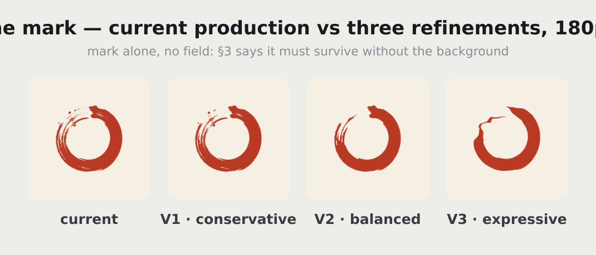
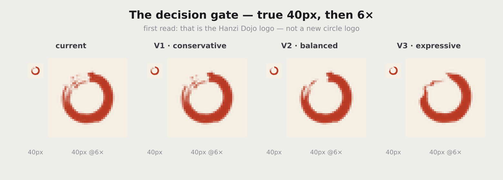
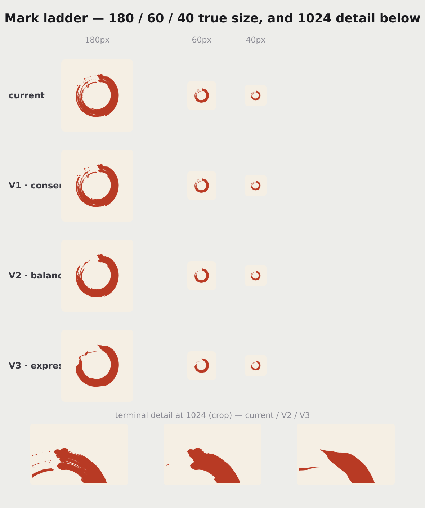
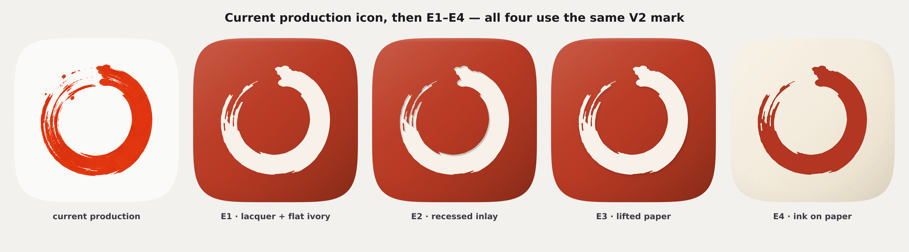
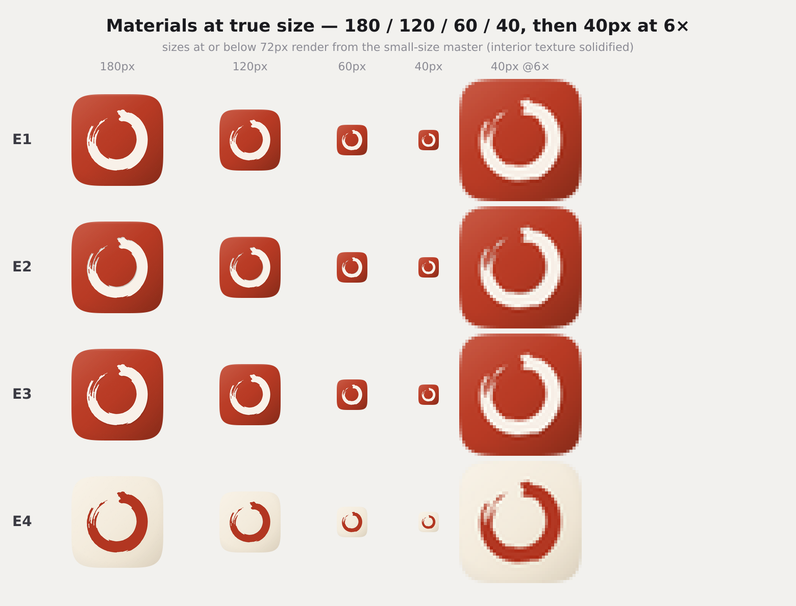
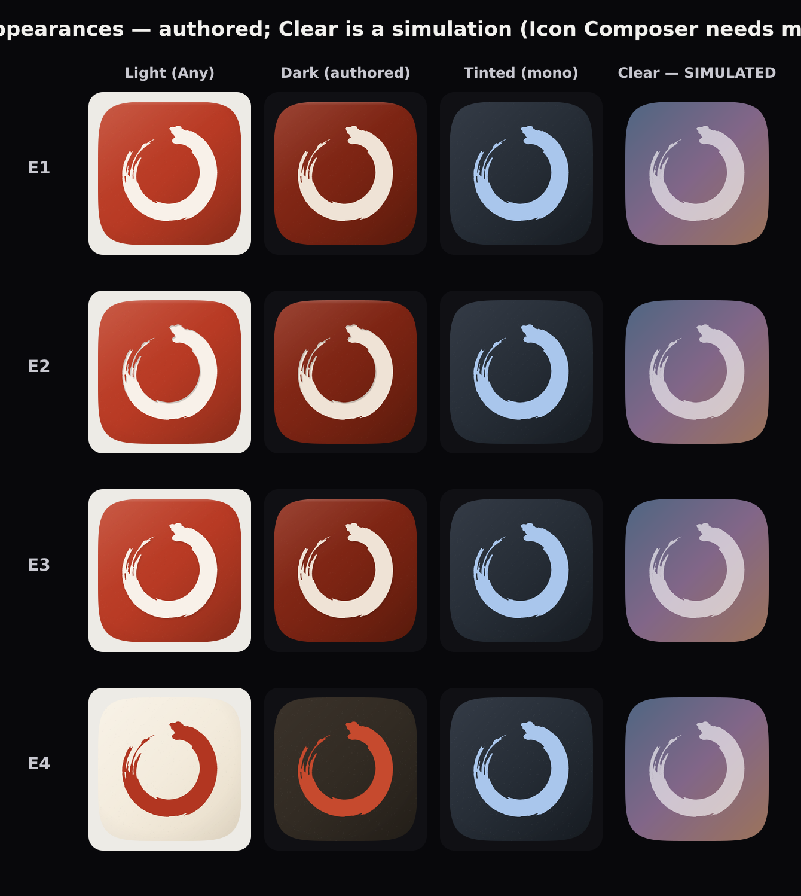
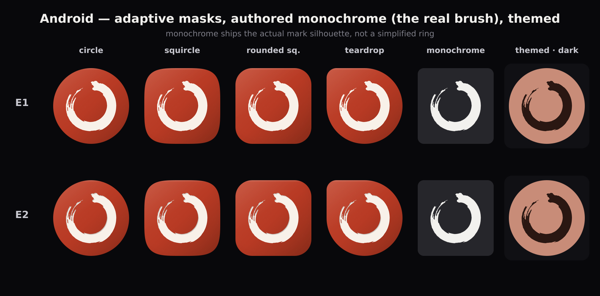
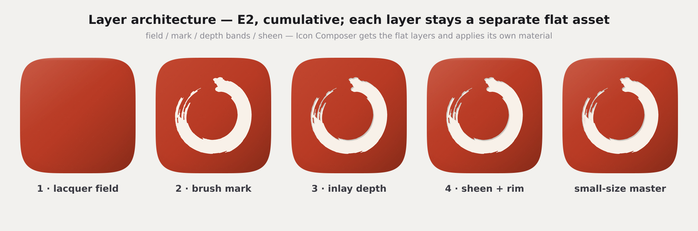

# P14 · App Icon V2 — brush-mark refinement + material gate

**Status: concepts only, stopped for approval.** No production asset was
modified — nothing under `ios/`, `android/`, `public/`, `assets/` or `src/`,
and `tools/generate-app-icons.mjs` is untouched. All output lives in
`docs/icon-v2/brush/`. The geometric-ring family (R1–R4) and the seal-mark
family (A1–A3) are superseded: **the expressive brush ensō is the logo and it
stays.**

Everything regenerates from one deterministic command:

```bash
node tools/icon-v2-brush.mjs        # writes only docs/icon-v2/brush/
```

> **Parallel-work note.** Nothing here reads or proposes changes to `Home.jsx`,
> navigation, the app shell/router, shared controls, shared design tokens,
> Home/nav tests or `Study.jsx`.

**How the marks were made — this matters for judging them.** V1–V3 are not
redrawings. They are image-processing passes over the actual production mark
(`src/assets/86055582-…png`, keyed exactly as the production generator keys
it), so the gesture is the original's own by construction:

* **V1 · conservative** — detached flecks under 150px² removed (the
  uncontrolled splatter), pinholes closed, edge alpha clamped. Everything else
  — every deliberate satellite blob, all dry-brush texture — kept.
* **V2 · balanced** — satellites removed, a morphological close(3) fuses only
  the dry-brush streaks thinner than ~6px (precisely the detail that dies
  below 120px), interior holes under 300px² filled, edge softened with a
  blur + smoothstep. The gap, taper, heavy/light modulation and silhouette are
  untouched — they are an order of magnitude larger than the close radius.
* **V3 · expressive** — a polar reconstruction: the original stroke's inner
  and outer radii measured at 1440 angles, median-filtered, the centreline
  smoothed hard (wobble reads as error) while the width keeps 25% of its
  measured residual (modulation IS the brush), terminals eased into deliberate
  tapers. Output is a true vector (`masters/mark-V3.svg`).

---

## 1 · Current → V1 → V2 → V3 at 180px



## 2 · The same four at true 40px



Full ladder with 1024 terminal detail: 

What the gate shows:

* **Current and V1 smear at 40px.** The splatter cluster at 10–11 o'clock
  aliases into a grey smudge — it reads as dirt, not brushwork. This is the
  single biggest quality defect of the production icon at small size, and V1's
  conservative cleanup does not remove enough of it.
* **V2 is the same logo, cleaner.** Gap visible, heavy right / dry left
  preserved, terminals still tapered — and the smudge is gone because the
  micro-streaks were consolidated before downscaling, not after.
* **V3 reads as a *different* ensō.** The reconstruction is honest to the
  measured gesture, but smoothing the centreline changes the hand — it becomes
  rounder, calmer, more "designed". It sits at (or past) the edge of the
  85–90% preservation rule.

## 3 · Mark recommendation

**V2 — balanced.** It is the only variant that passes both halves of the test:
at 40px it is *cleaner than production* while still being *unmistakably the
same logo*. V1 fails the first half (the smudge survives), V3 strains the
second (the hand changes). This confirms the stated hypothesis rather than
surprising it.

**One documented optical adjustment:** at sizes ≤72px, rendering switches to a
small-size master — the same V2 silhouette with interior dry-brush holes
solidified. The gap, taper and modulation are identical; only sub-pixel
interior texture (which aliases to grey mush) goes. Above 72px the full
textured mark renders.

---

## 4 · E1–E4, all using the exact V2 mark



Shared: anchor `#B83A24`; lacquer ramp `#C24730 → #B83A24 → #8E2D1A` (the low
end one step deeper than the seal study — lacquer is darkest in its depths);
warm ivory `#F8F1E9`, never `#FFFFFF`; one top-left light; fine deterministic
grain; sheen pulled far back (11% → 0 by 46%) plus a 20px lit rim; 7% corner
vignette; **no painted object shadow anywhere**.

* **E1 · lacquer + flat ivory** — the mark is flat. Cleanest by design.
* **E2 · recessed inlay** — two ~7px bands clipped inside the mark: shade on
  the top-left inner wall, light on the bottom-right inner edge. Inlay, not
  carving.
* **E3 · lifted paper** — a 5px-offset, wide-blurred 15% contact shadow under
  the mark plus a 3px lit top-left edge. (The first pass at 26%/9px offset
  read as a sticker — exactly what §6 forbids — and was pulled back.)
* **E4 · ink on paper** — reversed: ivory paper field with fibre grain,
  vermilion mark, 2px ink-pooling at the stroke edges.

## 5 · All four at true size



The honest finding: **at 40px, E1, E2 and E3 are indistinguishable.** All
material treatment scales out below ~120px, leaving exactly what §7 asked for
— at icon scale the difference is *felt* as richness at 180, not seen as
effects at 40. E4 alone differs at every size, because its difference is the
field, not the finish.

## 6–8 · iOS appearances



* **Light** — full vermilion material.
* **Dark (authored)** — the lacquer deepened to `#8F2E1C → #5C1B0C`, ivory
  dimmed to `#EFE3D6`. Never left to iOS synthesis (that is the audit's core
  finding). E4's dark is the interesting failure: ivory cannot stay ivory in
  dark mode, so it becomes dark paper with a vermilion mark — the red/ivory
  relationship flips, and the icon changes identity between modes. E1–E3 keep
  one identity everywhere.
* **Tinted (mono)** — **the actual brush silhouette**, gap, taper and
  dry-brush edges intact, as the light figure on a dark ground. No geometric
  stand-in. Rendered with a representative blue; the OS maps the greyscale
  through the user's chosen tint.
* **Clear — SIMULATED.** Icon Composer requires macOS; this sandbox is Linux.
  The column is the greyscale asset composited as frosted glass over a
  stand-in wallpaper and is labelled as such on the sheet.

## 9–10 · Android



Finalists E1 and E2 under circle / squircle / rounded-square / teardrop, with
the audit's corrections (background full-bleed, mark at safe-zone size). The
**monochrome layer is the real brush mark** — the small-size master silhouette,
flat on transparent — not a simplified ring; the themed column shows the
launcher recolouring it.

## 11 · Layer architecture



| # | Layer | Ships as |
|---|-------|----------|
| 1 | lacquer / paper field | flat colour; ramp + grain + sheen become Icon Composer settings, not baked pixels |
| 2 | refined brush mark | `masters/mask-V2.png` (alpha) — the one asset every surface shares |
| 3 | mark depth (E2 bands / E3 contact) | separate translucent layer, omitted at small sizes |
| 4 | material grain | separate, deterministic (seeded) |
| 5 | edge/highlight rim | separate |

Nothing is baked together in the masters; the preview compositor flattens for
display only. `masters/` holds the mark masks (`mask-*.png`), tinted marks
(`mark-*.png`), the V3 vector, and the Android monochrome
(`mono-approved.png`).

## 12 · Critique scores

10 = best. "Risk" rows are inverted — 10 = lowest risk.

| Criterion | E1 flat | E2 inlay | E3 paper | E4 reverse |
|-----------|:--:|:--:|:--:|:--:|
| Preserves Hanzi Dojo identity | **9** | **9** | **9** | 6 |
| Recognisable at 40px | **9** | **9** | **9** | 7 |
| Premium feel | 7 | **9** | 8 | 8 |
| Modern iOS quality | 8 | **9** | 8 | 7 |
| Dimensional quality | 6 | **8** | 8 | 6 |
| Simplicity | **10** | 8 | 7 | 8 |
| Distinctiveness | 7 | 8 | 8 | **9** |
| Dark appearance | **9** | **9** | 8 | 4 |
| Tinted appearance | **9** | **9** | **9** | **9** |
| Android themed | **9** | **9** | **9** | **9** |
| Risk of looking generic (10 = low) | 7 | 8 | 8 | **9** |
| Risk of looking AI-generated (10 = low) | **10** | 9 | 8 | 9 |
| **Total** | 100 | **104** | 100 | 91 |

The five questions, answered for the recommended pair (E2, V2 mark):

* **Does this still look like Hanzi Dojo?** Yes — it is the production mark's
  own pixels, cleaned; side by side with the current icon the read is "same
  logo, better made".
* **Materially better than the current icon?** Yes, twice over: the 40px
  smudge is gone, and the flat white field (the audit's dark/tinted failure)
  is replaced by a vermilion field that behaves in every appearance.
* **Recognisable among 30 icons?** Yes — it keeps the one thing already
  recognised (the brush ring) and adds the thing that was missing (a saturated
  field that owns its corner of the home screen).
* **Does the material support or distract?** E2's bands are clipped inside the
  stroke and vanish below 120px — they cannot distract at icon scale. E3 is
  the one that flirts with distraction (any visible shadow reads as sticker).
* **Does any detail exist only for 1024?** The grain, sheen, inlay bands and
  vignette all scale out below ~120px — deliberately. They exist for the App
  Store page and Settings, the two places an icon is seen large. Nothing in
  the 40px render exists only at 1024.

## 13 · Final recommendation

**Mark: V2. Material: E2 (lacquer + shallow inlay), with E1 as the
no-regrets fallback.** The user's hypothesis holds on both counts. E2 wins
because the inlay is the only depth treatment that is *inside* the mark —
it enriches without ever floating it; E1 is one point of restraint away and
would also be a fine ship. E3 stays interesting but its entire identity lives
in a shadow that must be almost invisible to be correct — a knife-edge not
worth balancing on. E4 answers its question: **no** — ink-on-paper is more
distinctive at 1024 but flips identity in dark mode and surrenders
red-dominance, which is the brand.

## 14 · Remaining risks

1. **The mark masters are raster** (V2 is a cleaned raster mask; only V3 is
   vector). Fine for every icon size — the masks are 1024px and icons max out
   at 1024 — but a future need for print/marketing at larger sizes would need
   the V3-style vectorisation done properly, or a re-key from higher-res
   source art.
2. **Icon Composer cannot run here.** The Clear appearance is simulated, and
   the final `.icon` assembly (and the choice between `.icon` and the
   three-PNG asset catalog — audit §3.3) needs a Mac with Xcode 26.
3. **In-app logo drift.** `src/assets/Hanzi-logo.png` (eight importing
   screens, including `Sidebar.jsx`) still shows the unrefined mark; the swap
   is asset-only but is sequenced behind the Home V3 migration.
4. **Favicon mismatch** remains (`public/favicon.svg` is a different geometric
   arc in a different red) — already on the audit's implementation list.
5. **The E2 inlay direction is an interpretation.** Shallow inlay light logic
   (shade top-left inside, light bottom-right inside) is physically coherent,
   but on a real device at 180px it should be eyeballed against E1 before
   committing — that check needs TestFlight, not this sandbox.

Implementation surface (unchanged): [`P14-APP-ICON-V2-AUDIT.md`](P14-APP-ICON-V2-AUDIT.md) §7.
