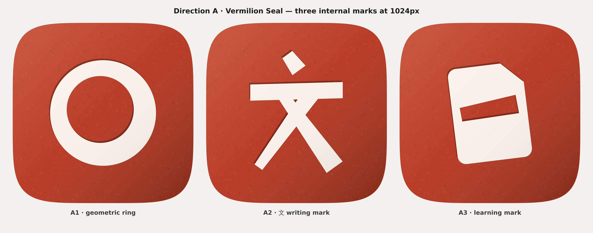
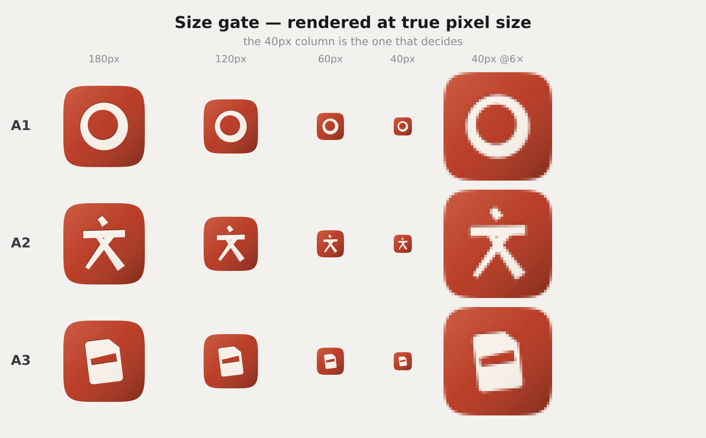
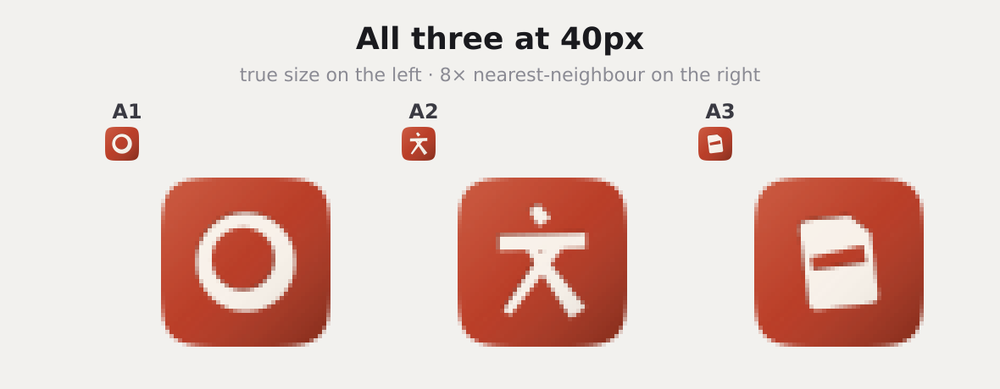
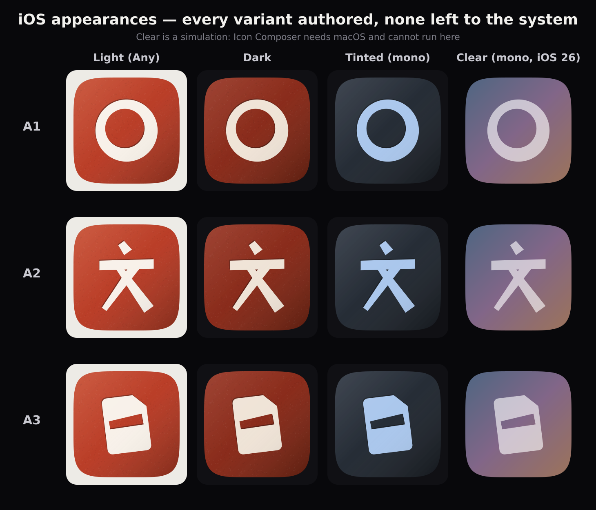
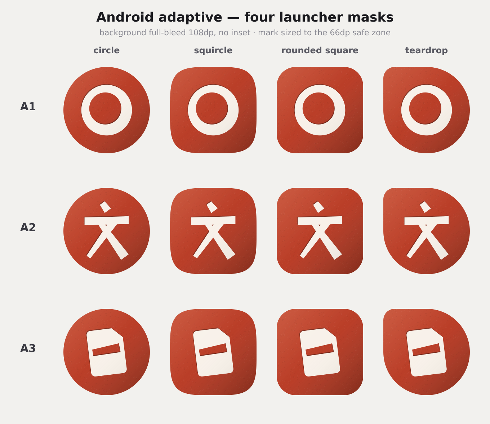
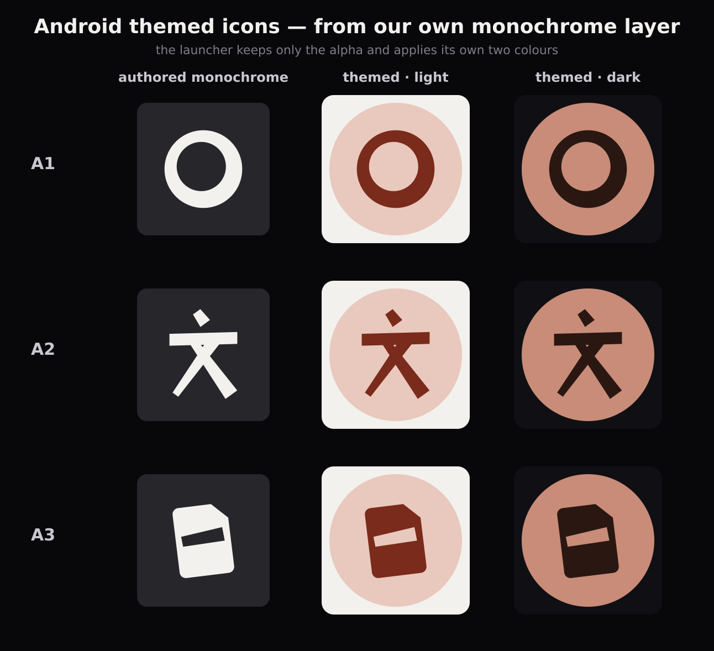
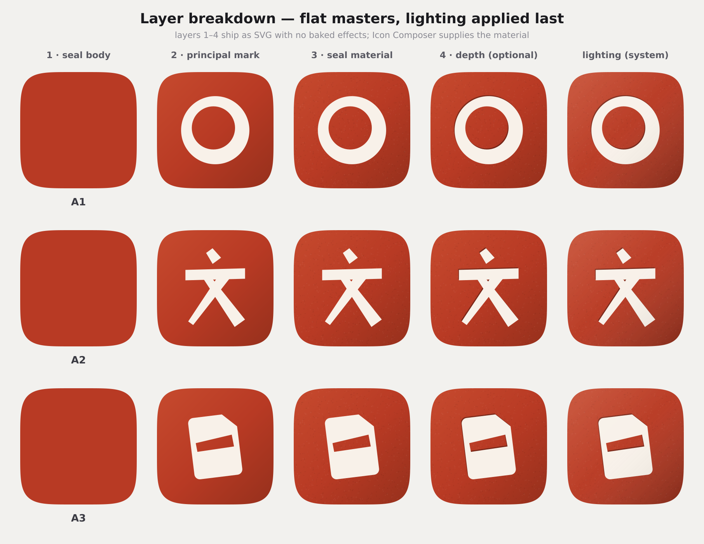
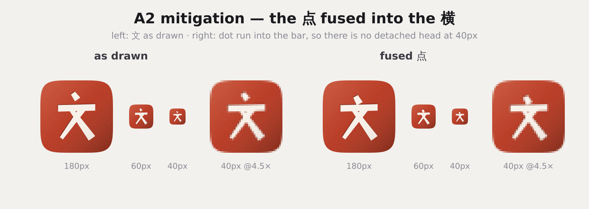

# P14 · App Icon V2 — visual concept gate

**Status: concepts only, awaiting approval of the internal mark.** No production
icon asset was replaced. Nothing under `ios/`, `android/`, `public/`, `assets/`
or `src/` was touched, and `tools/generate-app-icons.mjs` is unmodified. All
output lives under `docs/icon-v2/`.

Direction A — **Vermilion Seal** — is approved as the icon family. This document
compares three internal marks inside one identical seal body, under identical
conditions, and recommends one.

> **Parallel-work note.** Nothing here reads or proposes changes to `Home.jsx`,
> navigation, the app shell/router, shared controls, shared design tokens,
> Home/nav tests or `Study.jsx`. The one in-app knock-on
> (`src/assets/Hanzi-logo.png`, imported by eight screens including
> `Sidebar.jsx`) stays sequenced behind the Home V3 migration, as recorded in
> [`docs/P14-APP-ICON-V2-AUDIT.md`](P14-APP-ICON-V2-AUDIT.md) §7.

Everything is regenerated by one command, deterministically:

```bash
node tools/icon-v2-concepts.mjs      # writes only docs/icon-v2/
```

---

## 0 · The shared seal body

Identical across all three candidates. Nothing below varies by mark.

| Element | Value | Why |
|---------|-------|-----|
| Base | **`#B83A24`** | The product accent, unchanged (`src/languageTheme.js`, `chinese.accentHex`). |
| Highlight | `#C64A2E` | +7% relative luminance. The top-left end of the body ramp. |
| Shade | `#96301C` | −15%. The bottom-right end. |
| Mark | `#F8F1E9` | Warm paper, not UI white — a seal prints as bare paper, and a cold white reads as a screen. |
| Dark body | `#872817` → `#68200F` | −27% from base. A measured deepening, not a redesign. |
| Light source | Top-left, single | +10% at the top-left corner, −14% at the bottom-right. No second light anywhere. |
| Material | Seeded stipple, 5.5% black / 4.5% white | Vermilion seal paste never prints flat. Felt, not seen. Deterministic (seed `20260815`), so the master is reproducible byte-for-byte. |
| Depth | One offset copy of the mark, −6/−9px, 34% black | 白文 seals are **intaglio** — the character is cut into the stone and prints as bare paper. With the light at top-left, the near wall of that recess catches a hair of shade. At 40px this is 0.3px: it vanishes rather than muddying, which is what the size gate asks for. |

No baked drop shadow. No second gradient. No ornament. The corner rounding in
every preview is the OS mask (an `n=5` superellipse), never drawn into the art.

---

## 1 · The three candidates at 1024px



**A1 · geometric ring** — two true circles, the inner one offset up-left by
26px so the ring's weight modulates 84 → 136 (1.6:1) and thickens *away* from
the light. No dry-brush splinters, no detached flecks, no open Zen gesture,
closed all the way round. Constructed, not painted.

**A2 · 文 writing mark** — 文 (*wén*, "writing / language"), redrawn as a logo:
flat-cut terminals, geometric taper, authentic stroke logic — the 横 rises to
the right, the 撇 tapers away to a point, the 捺 swells to a flat foot. The two
diagonals deliberately overlap the bar so the character is one continuous
shape. Stroke weights were set by the 40px gate, not by the 1024 drawing.

**A3 · learning mark** — two primitives and one move: a page with a turned
corner, one 一 stroke cut out of it, and a 7° tilt. The 一 is negative space, so
the seal's own vermilion is what writes on the page.

---

## 2 · The size gate





This is the deciding sheet, and it is not kind.

* **A1 survives everything.** At 40px it is still a clean, unambiguous ring with
  an open counter. There is no size at which it degrades. It is the only
  candidate with nothing to argue about here.
* **A2 breaks at 60px and below.** The dot detaches, the bar becomes arms, the
  two diagonals become legs, and 文 reads as **a stick figure of a person**. It
  is fine at 180 and 120; it is not fine at the size that matters. See §7.
* **A3 holds its silhouette but loses its meaning.** The card stays legible, but
  the 一 collapses toward a dash and the whole reads as a tilted document with a
  minus sign — or, uncomfortably, a SIM card.

---

## 3 · iOS appearances



All four states are **authored**, none left to the system's automatic
treatment — which is the entire point of the audit's finding.

| Variant | How it is built |
|---------|-----------------|
| **Light (Any)** | Full-colour vermilion, opaque, no alpha channel (App Store Connect rejects one). |
| **Dark** | The seal body deepened −27%, mark dimmed to `#EFE3D6`. Note the deliberate departure from Apple's "transparent background" advice: that advice is for icons that are a mark on a plate, and here the plate *is* the identity. Dropping it would leave a floating ring on the system gradient and throw the design away. Both readings are in §9. |
| **Tinted (mono)** | Greyscale with the **mark as the light figure** and the body dark — the inverse of the current production icon's relationship. The system maps luminance through the user's tint; the preview uses a representative blue. |
| **Clear (mono, iOS 26)** | Simulated. Icon Composer needs macOS and cannot run in this sandbox, so this is the greyscale asset composited as frosted glass over a stand-in wallpaper. Treat it as indicative, not final. |

The structural win is visible at a glance: **every candidate keeps its identity
in all four states**, because a saturated field with a light mark is already the
luminance relationship dark, tinted and clear all expect. That was the argument
for Direction A and it holds up.

---

## 4 · Android adaptive masks



Rendered with the audit's §4 corrections applied: **background full-bleed 108dp
with no `<inset>`**, mark sized to the 66dp safe zone rather than 33% of the
canvas. No mask exposes a transparent edge, and the mark survives the circle
crop — which the current production icon's 16.7%-inset background cannot
guarantee.

---

## 5 · Android themed icons



From a **deliberately authored `<monochrome>` layer**, never system
auto-theming. Left column is the layer as authored: the mark alone, flat, on
transparent. Never the seal body — the launcher keeps only the alpha and
supplies its own two colours, so a body-inclusive monochrome layer would theme
as a solid blob.

The Android 16 QPR2 note stands: even where the platform can theme without one,
we ship our own so the result is predictable rather than inferred.

---

## 6 · Layer breakdown



Cumulative, left to right. Every layer ships as a flat SVG with **no baked
blur, shadow, gradient, opacity or translucency** — exactly what Icon Composer
asks for, because the system applies the Liquid Glass material itself.

| # | Layer | File | Notes |
|---|-------|------|-------|
| 1 | seal body | `masters/layer1-body.svg` | Flat `#B83A24` full-bleed. The body ramp is declared in Icon Composer as a gradient fill, not baked here. |
| 2 | principal mark | `masters/layer2-mark-{A1,A2,A3}.svg` | Fully opaque. A3 also has `layer2-mark-A3-fold.svg` for the turned corner if it is given its own tone. |
| 3 | seal material | `masters/layer3-material.svg` | Vector stipple, shared by all candidates. |
| 4 | depth *(optional)* | generated | The intaglio edge. In Icon Composer this is replaced by a real shadow setting on the mark group, not shipped as art. |
| — | monochrome | `masters/mono-{A1,A2,A3}.svg` | The Android `<monochrome>` layer. Mark only, flat white on transparent. |

Icon Composer allows a maximum of four groups, which this stack fits exactly.
The lighting stays separable throughout: the previews apply it as a final
composite pass, standing in for what the OS would do.

---

## 7 · A2's one fixable flaw



The stick-figure read at 40px comes from one thing: a detached 点 sitting above
a horizontal bar reads as a head above shoulders. Fusing the 点 into the 横
removes the head, and the mark stops being a person.

It works. The fused variant reads as a character at 40px where the as-drawn one
reads as a figure. The cost is character fidelity — a fused 点 is a logo-ised 文,
not a correctly written one, and a Chinese reader will see the liberty. That is
a normal logo compromise (the same one every wordmark makes) but it is a real
one and worth naming.

The size gate's own rule points here: *if an internal detail disappears at 40px,
remove it rather than making it louder.* The 点 does not disappear — it becomes
something worse. Fusing it is the version of "remove" that keeps the character.

---

## 8 · Harsh critique

### A1 · geometric ring

**It is a circle.** Stripped of the brush texture that gave the old mark its
character, what is left is the most-used shape in the entire icon economy — one
step from a record button, a target, a power ring, a generic "O". The offset
weight modulation is genuinely elegant at 1024 and completely invisible at
40px, where it is just a ring. Nothing about it says Chinese, says learning, or
says Hanzi Dojo; the seal body carries the whole cultural load and the mark
contributes nothing to it.

Worse, it preserves recognition **by keeping the exact silhouette that caused
the Japanese reading in the first place.** A red circle in a red field will
still be read as "that Zen circle app" by anyone who used the old icon, and the
ensō association travels with the shape, not with the brush texture. A1 answers
its own brief — *can we preserve recognition without Japanese iconography?* —
with: yes, but only the iconography leaves; the association stays.

Its virtues are real and should not be dismissed: flawless at every size,
outstanding tinted and themed, the strongest silhouette of the three, and zero
execution risk.

### A2 · 文 writing mark

**It breaks at the size that decides.** At 60px and below the as-drawn version
is a stick figure, and no amount of stroke weight fixes that — it is a
structural property of 亠 over 乂. §7 shows the fix works, but a mark that needs
a mitigation before it can ship is a mark with a defect.

Second problem: **文 is a real character, and using one as a logo is a
commitment.** It is not a neutral shape — it is a word with a meaning, and the
liberties taken to make it work as a mark (fused dot, geometric taper, flat
terminals) will read to a Chinese reader as a foreigner's approximation of a
character. Executed well that is charming; executed slightly wrong it is the
single most embarrassing failure mode available to a Chinese-learning app.

Third: it is close to the Google Translate register. A single white glyph on a
coloured tile is a well-worn pattern for language apps, and 文 specifically is
what a lot of them reach for.

Its virtue is decisive: it is the only candidate that says *Chinese-learning
app* before you have read the name.

### A3 · learning mark

**It is a file icon.** The 7° tilt buys some distance and the turned corner is
well-cut, but a rounded rectangle with a chamfered corner and a horizontal bar
is Files, Notes, Pages, Documents, and every SIM-card illustration ever drawn.
The negative-space 一 — which is a genuinely nice idea, the seal's own ink
writing on the page — is indistinguishable from a minus sign at any size below
120px, and at 40px it is a dash.

It also **discards the ring entirely**, so it has the identity cost of a full
rebrand with none of the payoff: it is neither recognisable as Hanzi Dojo nor
legible as Chinese. Its "learning" meaning is only available to someone who
already knows what the app does, which is exactly backwards for an icon.

The tilt is doing too much work. Remove it and the mark collapses into a
generic document; keep it and it looks like a document that has been knocked
over.

**Recommendation: drop A3.** It is the weakest on six of eight criteria and its
best quality — dimensionality by construction — is available to A1 and A2
through the shared seal body anyway.

---

## 9 · Scores

10 = best. "Distinctiveness" is scored so that **higher = less generic**.

| Criterion | A1 ring | A2 文 (as drawn) | A2 文 (fused 点) | A3 card |
|-----------|:-------:|:----------------:|:----------------:|:-------:|
| Recognizability vs the current icon | **9** | 4 | 4 | 2 |
| Chinese identity | 4 | **9** | 8 | 3 |
| Hanzi Dojo product meaning | 3 | 7 | 7 | 6 |
| Small-size performance (40px) | **10** | 5 | 7 | 6 |
| Premium feel | 8 | 8 | 8 | 5 |
| Dark appearance | 9 | 8 | 8 | 7 |
| Tinted / themed appearance | **10** | 7 | 7 | 6 |
| Distinctiveness (10 = least generic) | 4 | **8** | **8** | 2 |
| **Total** | **57** | 56 | **58** | 37 |

A1 and A2-fused finish within two points of each other, which is the honest
result: they are close, and they are close because they are strong at opposite
things. A3 is not in the conversation.

---

## 10 · Recommendation

**A2 · 文, with the 点 fused into the 横.**

The reasoning, in the order it matters:

1. **V2 exists to stop being a Japanese Zen symbol.** A1 removes the brush
   texture but keeps the circle, and the circle is what carries the ensō
   association. Shipping a red ring is shipping the same recognition problem in
   better clothes. 文 ends the question permanently.
2. **A2 is the only candidate that identifies the product at a glance.** On a
   home screen, a vermilion seal bearing 文 is unmistakably a Chinese-language
   app. A vermilion seal bearing a white O is unmistakably nothing.
3. **The seal body is not enough on its own.** It is a strong Chinese signal at
   1024 and on a store page; at 40px among sixty other icons it is a red
   rounded square, and red rounded squares are common. The mark has to carry
   identity at small size, and only 文 does.
4. **Its one defect is fixed, and the fix is shown.** §7 is the evidence. A1's
   defect — genericness — has no fix; it is the shape.
5. **It scores highest overall** (58 vs 57) while winning the two criteria that
   are strategic rather than tactical: Chinese identity and distinctiveness.

**Second choice: A1**, and it is a legitimate one. Choose A1 if continuity with
the existing (small) user base is judged more valuable than repositioning, or if
the risk of a non-native-drawn hanzi as a permanent logo is judged
unacceptable. If A1 is chosen, the ring should be given one more distinguishing
move before it ships — as drawn it is too close to a default.

**Drop A3.**

### Two things to settle before any asset is cut

1. **Have a Chinese reader review the 文 drawing.** Specifically the fused 点,
   the 撇 taper and the 捺 foot. This is the one part of the work that cannot be
   validated from inside the team, and it is the part with the worst downside.
2. **Confirm the dark-variant reading** (§3): keep the seal body and deepen it
   (drawn here), or follow Apple's transparent-background advice and let the
   system's gradient replace the field. The first keeps the design; the second
   is more literally compliant. Recommendation: keep the body — the audit's own
   argument for Direction A was that a saturated field is what makes dark and
   tinted behave, and a transparent dark variant gives that back.

---

## 11 · What ships when a mark is approved

Nothing in the file list below has been touched. The full implementation
surface — every iOS, Android, web and docs path — is enumerated in
[`docs/P14-APP-ICON-V2-AUDIT.md`](P14-APP-ICON-V2-AUDIT.md) §7 and is unchanged
by this document. The concept work adds exactly two things to it:

* the approved mark's masters move from `docs/icon-v2/masters/` into whatever
  form the delivery path needs (an `AppIcon.icon` built in Icon Composer on a
  Mac, or the three flattened PNGs of audit §3.1);
* `tools/generate-app-icons.mjs` is rewritten against the new layered master
  rather than the flattened stock raster it uses today.

`tools/icon-v2-concepts.mjs` is a concept tool, not a production one. It should
be deleted, or kept deliberately as the record of how the decision was made —
it does not participate in any build.
