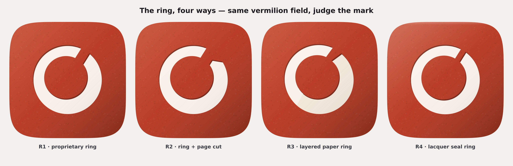
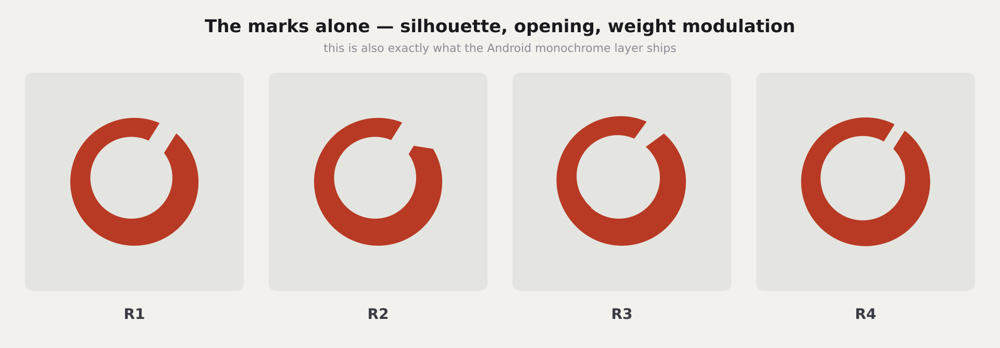
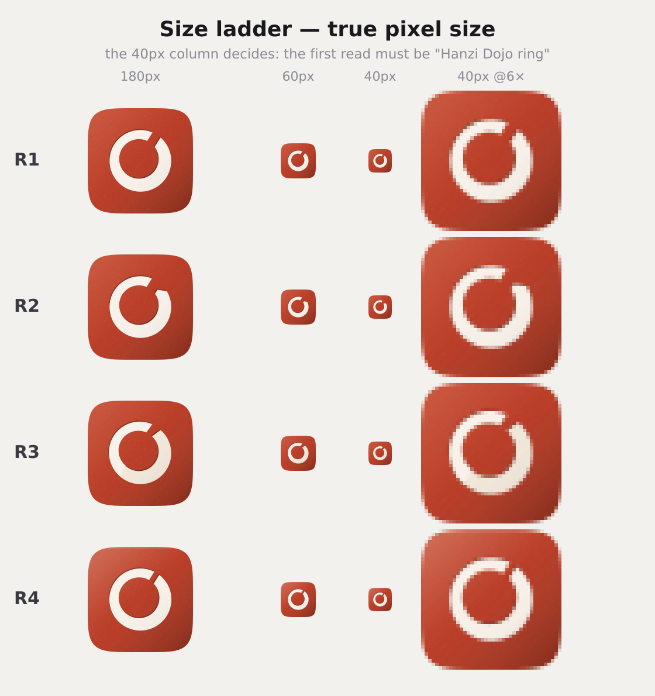
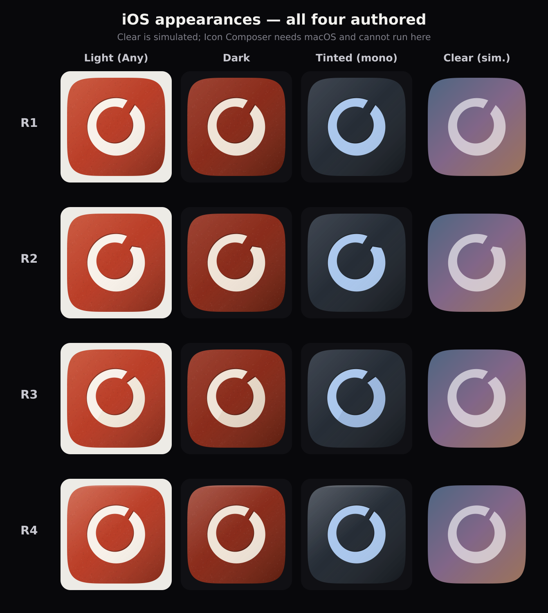
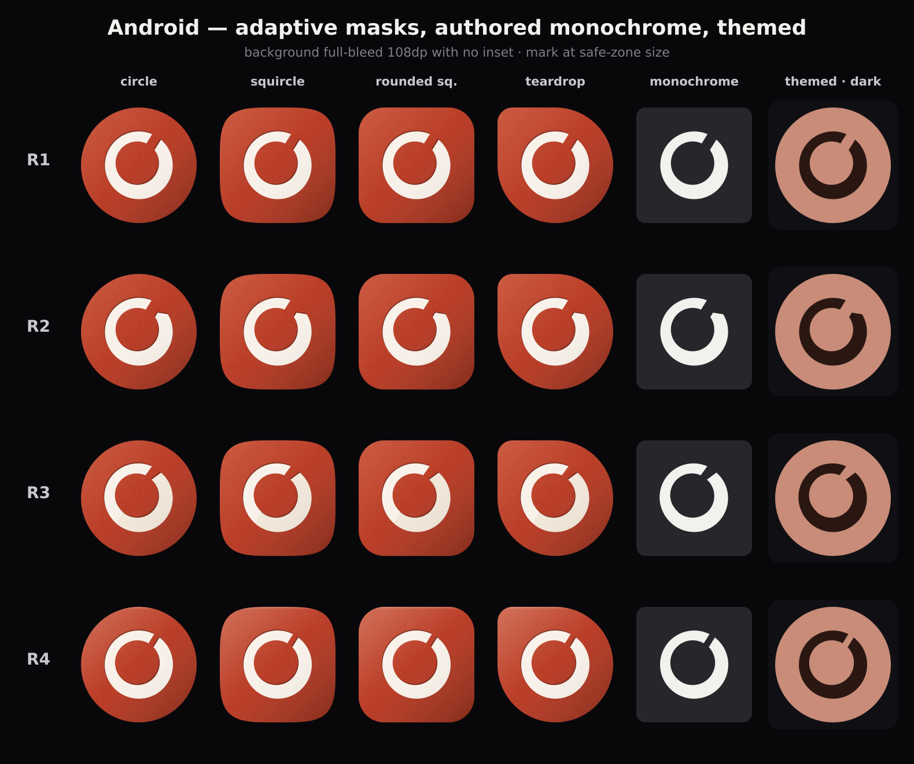

# P14 · App Icon V2 — the ring family (R1–R4)

**Status: visual comparison only, stopped for approval.** No production asset was
modified. Nothing under `ios/`, `android/`, `public/`, `assets/` or `src/` was
touched, and `tools/generate-app-icons.mjs` is unchanged. All output is under
`docs/icon-v2/rings/`.

A1 / A2 / A3 are rejected and superseded. The ring stays as the core Hanzi Dojo
logo. This document turns it into a proprietary mark that no longer reads as a
stock ensō, in four variants, judged against one hard rule:

> **At 40px the first read must be "Hanzi Dojo ring"** — not a target, a record
> button, a Chinese character, a document, or a notes app.

Regenerate everything with one deterministic command:

```bash
node tools/icon-v2-rings.mjs        # writes only docs/icon-v2/rings/
```

> **Parallel-work note.** Nothing here reads or proposes changes to `Home.jsx`,
> navigation, the app shell/router, shared controls, shared design tokens,
> Home/nav tests or `Study.jsx`.

---

## 1 · The two decisions that shaped all four

### Where the opening goes: back at 1 o'clock

The first build put the opening at 4 o'clock, on the reasoning that moving it
away from the ensō's break would help. It did the opposite. **It read as a gauge
or a progress ring**, and it threw away the one feature a returning user
actually recognises.

The opening is now at **−58°, roughly 1 o'clock — the same place the existing
logo breaks.** That position is brand equity and it is free to keep. What made
the old mark read as a stock ensō was never *where* it opened: it was the brush
texture, the tapered dry-brush terminals, and the detached ink flecks. All three
are gone. The break position stays.

### How the opening is cut: a slot, not a wedge

The first build also cut the opening as an angular gap — the same number of
degrees off the outer and inner boundaries. At an inner radius two-thirds of the
outer, that splays into a **pie-chart wedge**, which is why it looked like a
gauge.

The opening is now a genuine **slot**: the ring is cut by two truly parallel
lines `h` pixels apart, straddling the opening direction. Because a parallel
chord is not a radius, both terminals come out slanted by the same small amount,
in the same direction. That is what makes the cut read as deliberate rather than
as a brush lifting off the paper.

```
outer circle,  centre C, radius ro:   ro·sin(t − θ) = ±h/2
inner circle,  centre C+(dx,dy), ri:  ri·sin(s − θ) = ±h/2 − k,  k = (dx,dy)·n̂
```

---

## 2 · The shared field

Identical on R1, R2 and R3, so the comparison judges the mark. Unchanged from
the approved seal body: `#B83A24` base with a measured `#C64A2E` (+7% L) →
`#96301C` (−15% L) ramp, a warm-paper `#F8F1E9` mark, one top-left light source,
a seeded vector stipple for seal material, and an intaglio depth edge that
resolves to 0.3px at 40px.

**One declared exception: R4.** Its entire proposition is the material, so it
gets a lacquer finish the others do not. Its mark geometry is deliberately kept
near-identical to R1 so the comparison is still a fair one — R4 is asking "can
the finish alone do the work?", and there is no way to ask that without changing
the finish.

---

## 3 · The four variants at 1024px



| | Geometry | The idea |
|---|---|---|
| **R1** | `ro 300 · ri 192 · hole offset −14,−19 · slot 92px` | The hole sits 24px up-left, so the stroke runs **84 → 132** and thickens away from the light. Clean but not mathematically perfect. One flat-cut slot. |
| **R2** | R1 + `slot 104px · bevel 17°` | Same ring, same slot, with the closing terminal's outer corner faceted at ~45° so the negative space takes the profile of a turned page corner. |
| **R3** | Two strips, lapped 130–152°, front lifted 6px | Depth from real layer separation, plus a shade cast by the front strip onto the one beneath it. The strips stay concentric, so the silhouette is still R1's. |
| **R4** | `ro 302 · ri 198 · offset −13,−17 · slot 56px` | Silhouette barely touched. A soft sheen gradient and a lit top rim do the work — poured lacquer, not gel. |



---

## 4 · The size gate



**All four pass the hard rule.** At 40px every one of them reads as a ring with
a break — not a target, not a record button, not a document.

But the sheet says something more useful than pass/fail:

> **At 40px, R1, R2 and R3 are indistinguishable from each other.** The bevel is
> gone, the lap is gone, the tone step is gone. Only R4 differs, and only
> because its slot is narrower.

That reframes the choice. Picking between R1, R2 and R3 is not a decision about
the home screen — it is a decision about how the icon looks at 180px and above:
the App Store listing, the Settings list, the iPad. Worth making well, but not
worth agonising over.

---

## 5 · iOS appearances



All four states authored, none left to the system's automatic treatment. Light,
dark and tinted all hold — the saturated field with a light mark is already the
luminance relationship the appearance treatments expect. Clear is simulated;
Icon Composer needs macOS and cannot run in this sandbox.

**One finding worth acting on: R3's layer distinction disappears in tinted and
clear.** Both are single-tone treatments, so the tone step between the two
strips flattens out and R3 becomes R1. Its proposition survives in exactly two
of the four iOS appearances.

---

## 6 · Android



Rendered with the audit's corrections applied: **background full-bleed 108dp
with no `<inset>`**, mark at safe-zone size. No mask exposes a transparent edge
and every variant survives the circle crop.

The monochrome column is the authored `<monochrome>` layer — the mark alone,
flat, on transparent — not system auto-theming. R3 flattens here too: on themed
launchers all four are the same silhouette.

---

## 7 · Harsh critique

### R1 · proprietary ring

The weight modulation is the whole argument, and at 40px **it is invisible** —
1.6:1 across a 3px stroke is nothing. So at the size that matters, R1 is "a ring
with a slot in it", and the proprietary-ness lives entirely at 180px and up.

The slot is doing more work than the asymmetry, which raises a fair question:
if the slot is the differentiator, why is the ring also asymmetric? Two ideas
competing quietly. It survives as a design because both are restrained, but a
sharper mark would commit to one.

Against that: it is unambiguously not an ensō, it is clean, it is the lowest
execution risk in the set, and it is the only one whose idea survives the size
ladder fully intact.

### R2 · ring + page cut

**The page-cut story does not survive contact with the size gate.** The facet is
legible at 1024, arguable at 180, and gone by 120. Below that R2 is R1 with a
slightly wider slot. A brand story that only works in the design file is not a
brand story.

It is also the one variant where the added move makes the mark *less* clean:
the faceted terminal is the least resolved shape in the family at 1024, and it
draws the eye to the gap rather than to the ring. "Discoverable, not literal"
was the right instruction; what came back is closer to "invisible, then
arbitrary".

If the product meaning matters more than the small-size cost, R2 is the version
to develop — but it needs the facet twice as large, which will cost ring.

### R3 · layered paper ring

**Its entire proposition is invisible on more surfaces than it is visible on.**
Gone in tinted, gone in clear, gone in Android themed, gone at 60px and below.
That is four of the contexts the icon actually ships into.

There is also a rendering-honesty problem: as a flattened PNG, the layer
separation has to be *baked* as a tone step plus a painted shade. At 1024 the
lap edge reads as a straight diagonal line across the lower-left of the ring,
and the first thing a fresh eye asks is whether it is a bug.

**But the idea is not wrong — the medium is.** Real layer separation, rendered
by the system with its own shadow and specular, is precisely what Icon Composer
does, and R3 is the only variant designed for it. It should be re-judged on a
Mac with Icon Composer rather than dismissed on the strength of a baked
approximation.

### R4 · lacquer seal ring

**It barely does what the brief asked.** The goal was to make the ring
proprietary; R4's mark is a slightly heavier ring with a narrower nick. Strip
the finish and there is almost nothing to distinguish it from a default ring —
and the finish is **completely invisible at 40px**, where a 13%-opacity gradient
across 40 pixels is nothing at all.

So R4's differentiation exists only at 1024. On a home screen it is the *least*
proprietary of the four, which is the opposite of what it was asked to be.

Against that: it is the best-looking icon in the set at large sizes, the
strongest at 40px (the narrow slot keeps the ring closed and unmistakable), and
its restraint is correct — the first lacquer pass read as a gel button and had
to be pulled back hard.

---

## 8 · Scores

10 = best. Execution risk is scored so higher = lower risk.

| Criterion | R1 | R2 | R3 | R4 |
|-----------|:--:|:--:|:--:|:--:|
| "Hanzi Dojo ring" at 40px | 9 | 8 | 9 | **10** |
| Proprietary — not a stock ensō | 8 | **9** | 7 | 5 |
| Premium feel at 1024 | 8 | 7 | 8 | **9** |
| Dimensionality | 6 | 6 | **9** | 8 |
| The idea survives to 40px | 8 | 4 | 3 | **9** |
| Dark appearance | **9** | **9** | 8 | **9** |
| Tinted / clear | **9** | 8 | 6 | **9** |
| Android themed | **9** | 8 | 6 | **9** |
| Execution risk (10 = lowest) | **9** | 7 | 6 | **9** |
| **Total** | **75** | 66 | 62 | **77** |

The totals are misleading on their own and should not be read as the answer.
R4 tops the table while scoring **lowest on the brief's actual objective** —
making the ring proprietary. R1 is second overall and second on that objective,
which is why the recommendation below is not simply "the highest number".

---

## 9 · Recommendation

**Ship R1's geometry with R4's material.**

They are not competing variants. They sit on different axes and the brief
happened to separate them: R1 is a decision about the *drawing*, R4 is a
decision about the *finish*. Nothing prevents taking both, and taking both is
strictly better than either alone.

* **R1 supplies what the brief asked for.** The flat parallel slot, the absent
  brush texture and the controlled asymmetry are what stop it reading as a stock
  ensō, and they are the only differentiators that survive the whole size
  ladder.
* **R4 supplies the premium.** The soft sheen and lit rim are what make it look
  authored rather than generated, at the sizes where anyone can see it — the
  store listing, the Settings list, the iPad.
* **Together they cost nothing.** R4's finish is a field treatment; R1's
  geometry is a mark. They do not interact.

**Second choice: R2**, if the page-cut meaning is judged worth developing. It
needs the facet at roughly twice its current size to survive past 120px, and
that trade should be looked at before committing.

**R3: do not drop, defer.** Its depth is invisible on four of the surfaces it
would ship into *as a flattened raster* — but flattened raster is the wrong
medium for it. Re-judge it in Icon Composer on a Mac, where the layers are real
and the system renders the shadow. It is the only variant built for the delivery
format we are heading toward.

### Two things to settle before any asset is cut

1. **Slot width.** R1's 92px slot and R4's 56px read very differently at 40px —
   the narrow one keeps the ring closed and unmistakable, the wide one makes the
   opening a clear feature. This is the single highest-leverage number in the
   whole mark and it deserves a direct A/B at 40px before anything is committed.
2. **Whether the asymmetry earns its place.** The 1.6:1 weight modulation is
   elegant at 1024 and invisible at 40. If the slot is carrying the identity,
   a perfectly concentric ring may be the cleaner mark — worth one comparison.

---

## 10 · Files

Concept output only — none of this is a production path.

```
docs/icon-v2/rings/masters/    mark-{R1..R4}.svg, mono-{R1..R4}.svg, body.svg, material.svg
docs/icon-v2/rings/previews/   R-01…R-05 sheets, true{40,60,120,180}-{R1..R4}.png
tools/icon-v2-rings.mjs        the deterministic renderer
```

The masters are flat SVG with no baked blur, shadow, gradient or translucency —
what Icon Composer expects, since the system applies the material itself. The
lighting in every preview is a final composite pass standing in for the OS.

The implementation surface for whichever variant is approved — every iOS,
Android, web and docs path — is unchanged from
[`docs/P14-APP-ICON-V2-AUDIT.md`](P14-APP-ICON-V2-AUDIT.md) §7.
