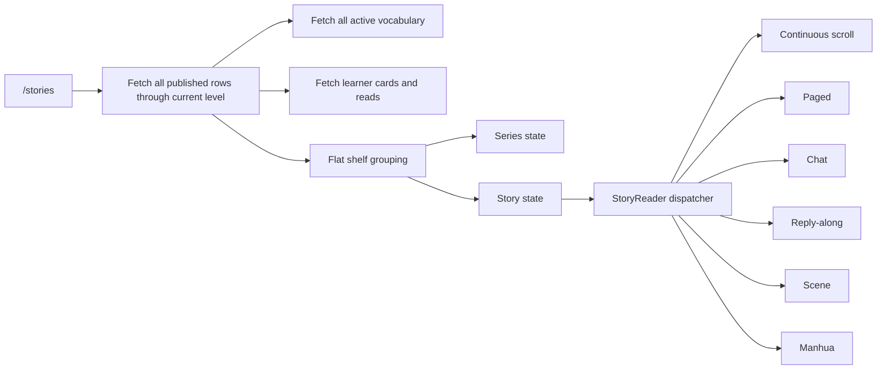

# Hanzi Dojo Story Experience Audit

**Audit date:** 2 August 2026
**Scope:** Chinese story discovery, library, series, reader modes, learning interactions, completion, content, covers, manhua art, accessibility, responsiveness, and delivery performance
**Deliverable type:** Audit and redesign direction only. No redesign code is included in this document.

## Executive verdict

Hanzi Dojo already has the hard part: a large graded-reading catalogue, reliable word lookup, line translation, narration infrastructure, persistent progress, and genuinely distinctive manhua art. The experience is functionally broad but product-design maturity is uneven. The library behaves like a database rendered as cards, while the six reader implementations behave like separate products. This creates a long, repetitive shelf; inconsistent controls; accessibility gaps; and a finish experience that is complete for only three standalone manhua.

The highest-leverage direction is **one calm story system with several content canvases**:

1. A compact, hierarchy-first library built around “Continue reading,” level, and series—not a single page of every story card.
2. One routable story/detail/reader model, with browser history and deep links.
3. One shared reader shell and learning toolbar across prose, chat, scene, and manhua.
4. Narrative stories remain uninterrupted; assessed replies belong in clearly labelled Practice or at the end.
5. A content operations contract for level fit, covers, translation, audio, and completion checks before publication.

### Scope counts

| Audited surface | Count |
|---|---:|
| Screen/state variants | 24 |
| Published Chinese story/chapter rows | 204 |
| Story implementation modules/components | 32 |
| Reader presentations in production | 4 database modes / 6 UI implementations |
| Requested responsive viewports tested | 9 |
| Authored manhua story manifests | 8 |
| Local manhua panel assets | 127 WebP files |
| Chinese cover-manifest records | 209 |
| Severity findings | 0 Critical, 10 High, 14 Medium, 6 Low |

There are **no Critical findings** because the audited live flows could be opened, read, resumed, and completed without a confirmed data-loss or universal task-blocking failure. “High” here means a systemic problem that materially impairs reading, comprehension, accessibility, or maintainability.

## Method and evidence

The audit used four evidence sources:

- The current production experience at `https://www.hanzi-dojo.com/stories`, signed in at HSK 3.
- Live, read-only Supabase queries against all published Chinese story rows, story questions, utterances, and generated TTS records.
- The repository architecture, reader implementations, shared learning components, design tokens, tests, local manifests, and image assets.
- Rendered DOM and computed geometry at 320×844, 375×812, 390×844, 430×932, 768×1024, 1024×768, 1280×800, 1440×900, and 1920×1080.

The signed-out public share page was reviewed from its route, implementation, and states. A signed-in production session intentionally redirects `/read/:id` into the internal Stories state, so that page was not session-mutated merely to obtain a second visual sample.

The 24 states were: loading library, populated library, filtered library, empty filter, current-tier lock, next-level lock, series chapter list, standalone card, paced launch, paced active, continuous scroll, chat launch, chat active, scene launch, scene active, reply-along launch, reply choice, manhua active, manhua answer gate, word lookup, reader settings, finish, comprehension, and public share.

The 32 reviewed modules/components were `App`, `routes`, `Stories`, `StoryReader`, `readerMode`, `StoryReaderImmersive`, `PacedReader`, `SceneReader`, `ChatReader`, `InteractiveChatReader`, `ChatThread`, `ManhuaReader`, `ManhuaPanel`, `ManhuaBubble`, `ManhuaChoiceCard`, `ManhuaCompletion`, `ReadingScaffold`, `ReaderLaunch`, `WordLookupSheet`, `FinishOverlay`, `ComprehensionCheck`, `AudioButton`, `StoryCover`, the interactive `Word` renderer, `storyReading`, `storyShelfFlat`, `storyShelf`, `storyArcs`, `storyList`, `storyFormat`, `manhuaLayout`, and the manhua progress/token modules.

## Architecture and experience map

### Current route and state model

- `/stories` is the only signed-in story route.
- Browse, series, and reader screens are internal React state in `Stories.jsx` (`selectedStory`, `selectedArc`, and `view`).
- `/read/:id` is a signed-out teaser. Signed-in visitors are redirected to `/stories`, where the story opens internally.
- No URL represents a series, chapter, reader mode, current beat, or completion state.

That model keeps implementation simple, but it makes refresh, browser Back, deep linking, sharing, support reproduction, and analytics attribution unnecessarily fragile.

### Current data flow



At HSK 3, the serialized story response alone is approximately 365 KB before HTTP compression, vocabulary, cards, reads, and images. At HSK 6, the 204 story rows serialize to approximately 543 KB. The route is code-split, but `StoryReader.jsx` statically imports every reader, so opening the library loads a 106 KB built Stories chunk that contains all reader modes.

### Primary learner journey and friction

| Step | Current behavior | Friction | Design objective |
|---|---|---|---|
| Discover | Daily hero, two filter groups, then all reachable levels | Page hierarchy is dominated by catalogue length; intent and continuation compete | Lead with Continue, then level/series collections |
| Evaluate | Cards show cover, `% known`, title, summary, HSK, format, status | Series cards omit premise and stable identity; standalone cards are taller; emoji formats feel provisional | One card grammar with stable series art and clear commitment |
| Start | Some formats open a launch gate; manhua opens immediately | Entry behavior varies by format; launch uses a generic sage CTA | One story-detail contract and explicit Resume/Start |
| Read | Six different layouts and control arrangements | Learners relearn chrome and progress semantics | One reader shell, content-specific canvas |
| Learn | Tap word, pinyin, translation, line/story audio | Most controls are 24–36 px; classic can expose 61 word tab stops for an 11-line story | 44 px targets, roving focus, one contextual learning dock |
| Progress | Story/beat progress is saved; shelf marks status | Internal state is not URL-addressable; series cover changes to next unread chapter | Stable series identity and routable resume point |
| Finish | Word recap, optional quiz, reward/next story | 201 of 204 rows have no authored comprehension; completion varies by reader | One compact end sheet with consistent reward and optional end check |

## Severity findings

### High — fix before expanding the format

| ID | Finding | Evidence | Consequence | Recommendation |
|---|---|---|---|---|
| H1 | Primary reader controls are undersized across every reader family | Live mobile geometry: translation 23.6–24 px, manhua line audio 28.6 px, classic chrome 26–36 px, paged “Got it” 34 px, chat advance 24 px; library filters 31 px and chapter actions 26 px | Missed taps, motor-access barriers, and frequent accidental activation beside text | Make every discrete control at least 44×44 CSS px; preserve 8 px separation; do not enlarge the glyph only |
| H2 | Every published manhua still contains an in-story answer/choice gate | All 8 `panels` structures contain choice data; production `《楼上没有声音》` stops after four panels at “选择回答 / Choose a reply to keep reading” | Breaks narrative immersion and contradicts the product decision to remove mid-story answers | Linearize all eight manifests and production rows; retain choices only in explicitly labelled Practice or end checks; remove dormant `ManhuaChoiceCard` after migration |
| H3 | The shelf does not scale on phones or tablets | Live page height: 13,305–14,854 px at 320–430; 16,571 px at 768 because the desktop sidebar consumes 236 px and the grid stays one column; all story units remain in the DOM | Discovery becomes scrolling endurance; larger tablet is paradoxically the worst viewport; rendering cost grows with catalogue | Progressive level disclosure, compact list rows on narrow widths, virtualize/collapse unopened sections, and delay desktop sidebar until content can sustain two columns |
| H4 | Story navigation is not routable | Browse, series, reader, and selection are `Stories.jsx` state; URL remains `/stories` | Back/refresh/share/resume/support links cannot describe what the learner sees | Add `/stories/:storyId`, `/series/:seriesKey`, and a replaceable `?beat=`/`?mode=` resume parameter; synchronize internal state with history |
| H5 | Keyboard and screen-reader ergonomics are systemic rather than local | Continuous reader exposed 61 tabbable word controls for an 11-line story; modal sheets focus in/restore but do not trap focus; locked disabled cards hide their explanation from keyboard; document remains `<html lang="en">` while Chinese is read | Exhausting navigation, focus escape behind modal content, and incorrect pronunciation cues | Use sentence-level roving tabindex, focus traps/inert background, focusable lock explanations, and `lang="zh-Hans"` on story text with English translations marked `lang="en"` |
| H6 | Eight authored Chinese entries fail their declared vocabulary-coverage gate | Validator failures: `放学以后` 84%, `下雨天` 64%, `我的早上` 74%, `在动物园` 65%, `周末的电影` 88%, `新的决定` 87%, `坚持` just below its 88% threshold, and `2. 一个办法` 85% | Beginner “graded” trust is weakened precisely in the short practice formats meant to feel easiest | Rewrite out-of-pool words or deliberately re-level; make live publication refuse validator failures rather than relying on a separate report |
| H7 | Comprehension is effectively a three-story feature | Only 9 Chinese question rows exist—three questions each for `《一块钱》`, `《末班车》`, and `《楼上没有声音》`; 201/204 published entries have no authored end check | Completion and learning value differ dramatically by title, making rewards incomparable | Add one lightweight end check per chapter and three per standalone story; use “Continue without quiz” only if assessment is intentionally optional |
| H8 | Audio availability is sparse and metadata is not a reliable truth source | 151/204 rows have `has_audio=false`; 32 stories have utterance rows with complete generated audio, including 7 whose flag is false; approximately 144 stories have neither a positive flag nor utterance clips | Shelf audio badges can lie; learners meet silent stories without expectation setting | Derive availability from assets, not a mutable Boolean; backfill narration in batches; show “Narrated” only when a playable source passes verification |
| H9 | The visual system has fragmented into six products | Across 13 core story UI files: 335 inline-style blocks, 22 unique hard-coded hex values, and 19 radius values; settings, completion, typography, and controls differ by reader | Polish work multiplies, dark mode drifts, and learners must relearn the interface | Build `StoryShell`, `LearningToolbar`, `StoryProgress`, `StoryEnd`, and shared surface/type tokens; let each mode supply only its content canvas |
| H10 | Cover availability and story identity are incomplete | 10 live rows have no `image_path`: three early HSK 1 prose chapters and seven manhua; series cover changes to the next unread chapter; cover fallback is a gradient plus emoji | Premium manhua can look least premium on the shelf; a series lacks a stable visual memory | Author stable series/standalone key art, generate missing chapter covers, and separate series key art from next-chapter thumbnail |

### Medium

| ID | Finding | Recommendation |
|---|---|---|
| M1 | Cards vary by roughly 40–60 px in a row because standalone metadata and summaries use different structures | Reserve fixed title/meta rows; move premise to detail or a consistent two-line clamp |
| M2 | At 320 px, stacked card decoration measures 322–329 px from an x-position of 16 even though the document itself reports no overflow | Remove offset pseudo-card layers below 360 px or include them in the width calculation |
| M3 | Series detail is a chapter grid without key art, premise, characters, genre, or “why continue” context | Add a real series header and stable progress/next-chapter action |
| M4 | The daily hero, level shelf, and `% known` all compete as first priority | Make Continue/Today a single resume module and demote secondary discovery |
| M5 | Loading is one centered symbol; fetch errors can silently become cached or empty content; empty filters lack a recovery action | Provide shelf skeletons, offline/stale timestamp, retry, and one-click “Clear filters” |
| M6 | Disabled lock cards are visually calm but not operable or explainable to keyboard users | Use a focusable card or adjacent disclosure with exact unlock requirement and destination |
| M7 | The public `/read/:id` teaser is a separate generic 220 px card experience and does not express manhua/series identity | Reuse the same story-detail header and a read-only sample canvas |
| M8 | Six non-manhua practice entries have no aligned English content | Add translations or explicitly label immersion-only practice before launch |
| M9 | Scene mode uses a 72 px emoji as the illustration and has no story image asset | Either make Scene a deliberate iconographic drill or give it real, consistent scene art |
| M10 | Continuous reading combines a fixed 85 px audio bar with a 57 px mobile nav and 200+ px bottom padding | Use one compact bottom dock and hide global nav during immersive reading with an obvious exit |
| M11 | Manhua’s paper/ink light canvas is coherent but abruptly ignores the app’s dark theme | Keep paper panels light, but theme the surrounding chrome and add a low-glare paper token |
| M12 | Panel files have no responsive variants or `srcset`; 127 WebPs total 25.2 MB, median 192 KB, maximum 821 KB, across 21 dimensions | Generate width variants, declare `sizes`, cap mobile decode dimensions, and enforce a per-panel byte budget |
| M13 | The global rise animation is 520 ms; multiple cards also animate hover via React state | Standardize 120/180/240 ms motion, use CSS media queries, and keep reduced-motion behavior |
| M14 | Completion stacks new-word recap, add-to-deck, finish, next story, audio, and sometimes quiz in different orders | Use one end sheet: achievement, one learning reflection, optional end check, next action |

### Low

| ID | Finding | Recommendation |
|---|---|---|
| L1 | Format is communicated with OS-dependent emoji (`📖`, `💬`, `🎬`, `🖌️`) | Use the existing Lucide icon family and text label |
| L2 | Numbered database titles repeat chapter numbers inside chapter contexts | Separate `chapter_number` and display title from the authored string |
| L3 | Cover images use empty alt text everywhere | Keep empty alt only when adjacent title fully replaces the image; give meaningful art alt to standalone/public hero art |
| L4 | At 1920 px the shelf remains near 1040 px, leaving very large gutters | Allow a five-column discovery grid or a useful contextual rail; keep prose reader narrow |
| L5 | Copy alternates among “Library,” “Stories,” “All stories,” “Back to start,” “Got it,” and “Tap ✓” | Define one navigation and progression vocabulary |
| L6 | Hover elevation and card motion add noise to an already dense shelf | Reserve motion for state changes and active continuation, not every card |

## Library and card audit

### What works

- Level sections, current-level labelling, read counts, readiness percentage, tier locks, and next-level preview give learners useful curriculum context.
- Covers reserve a 16:9 area and have a failure fallback, avoiding broken-image glyphs.
- Standalone manhua show chapter count and estimated time.
- Read/unread and Story/Practice filters are understandable and cause no horizontal document overflow at any tested width.
- Real production cover files sampled in the series list were 1344×768, so source resolution is generally sufficient for card display.

### What does not yet feel designed

- The visual page title is hidden to privilege the daily hero, so the page lacks a stable visible anchor.
- The learner sees one enormous inventory instead of a sequence of decisions.
- Cards mix five concepts—readability, format, level, completion, and lock state—with summary copy, producing noisy accessible names and inconsistent heights.
- A series card’s picture changes with progress because it uses the next unread chapter cover. That is operationally clever but weak brand memory.
- Standalone manhua receive more metadata than legacy serials, making legacy work look second class.
- Chapter-count overlay buttons are only 26 px high and sit on artwork.
- The same card component owns hover state in React; many card instances can rerender for decoration that CSS can handle.

### Recommended information hierarchy

1. **Continue reading**: one stable card, last story/chapter, progress, estimated remaining time.
2. **Your level**: 3–5 recommended units ranked by readiness and novelty.
3. **Series**: collapsed by series identity; expose one next chapter, not every chapter.
4. **Standalone stories**: complete stories with genre, duration, and narration status.
5. **Practice**: a separate collection, because reply-along and scene drills have different learner intent.
6. **Earlier levels**: collapsed by default after the learner has sufficient current-level material.
7. **Next level**: one teaser row, not four disabled full cards.

## Responsive audit

All requested widths avoided document-level horizontal overflow. The problem is vertical scale and breakpoint behavior, not basic containment.

| Viewport | Live page height | Layout observed | Main issue |
|---|---:|---|---|
| 320×844 | 13,305 px | One column; filters wrap to two rows; 57 px bottom nav | Card visual layers exceed nominal canvas width; tiny 26/31/40 px actions |
| 375×812 | 13,661 px | One column; filters wrap | Very long catalogue; cards 268–311 px tall |
| 390×844 | 14,016 px | One column; filters wrap | Standalone card 320 px tall; key actions remain undersized |
| 430×932 | 14,854 px | One column; both filter groups fit one row | Wider cards become taller, so larger phone requires more scrolling |
| 768×1024 | 16,571 px | 236 px sidebar + 532 px content; one column | Worst breakpoint: desktop chrome with mobile content density |
| 1024×768 | 8,154 px | Sidebar + two columns | Usable but still a very long shelf |
| 1280×800 | 4,195 px | Sidebar + four columns | Good density; card heights still mismatch |
| 1440×900 | 4,195 px | Sidebar + four columns | Stable, readable density |
| 1920×1080 | 4,195 px | Same four columns in a 1040 px content container | Excess unused space for a discovery surface |

### Proposed breakpoints

| Range | Library | Reader |
|---|---|---|
| 320–479 | Compact rows or one feature card + rows; no offset card decoration | Full-width canvas, 16 px gutters, fixed 44 px learning dock |
| 480–767 | One feature + two compact rows where space permits | Full-width canvas, 20 px gutters |
| 768–1023 | Two-column content; bottom/compact nav, not 236 px sidebar | 680–760 px centered reader |
| 1024–1279 | Three-column library with sidebar | 720 px prose / 840 px manhua |
| 1280–1599 | Four columns | Same reader widths; useful side metadata only |
| 1600+ | Five columns or four plus a meaningful Continue/series rail | Never widen prose merely to fill space |

## Reader and learning interaction audit

### Shared strengths

- Word lookup exposes Hanzi, pinyin, definition, source sentence, add-to-deck, and audio.
- Focus moves into the lookup and returns to its opener.
- Reader settings expose pinyin modes, font choice, and playback speed.
- `aria-live` and progress semantics exist in several modes.
- Global `:focus-visible`, skip link, and reduced-motion rules provide a solid baseline.
- Manhua images reserve aspect ratio, eager-load the first two panels, lazy-load later panels, and use descriptive alt text.

### Continuous scroll

The 700 px reading column and 20–22 px body text are comfortable. Line translation and sentence focus are understandable. The cost is control density: per-word tab stops, per-line translation buttons, top controls, a fixed narration bar, bottom navigation, new-word recap, finish, and next-story actions all occupy the same journey. On a sampled 11-line story, 87 interactive elements were in the DOM and 61 words were tabbable.

**Direction:** preserve visual reading rhythm but make a sentence the keyboard unit. Arrow keys can move among words only after entering word-explore mode. Move translation/audio to one 44 px contextual row for the focused sentence.

### Paged

The 30 px Chinese line and blurred past/future beats create focus. Progress is clear. However, `Back to start` adds an unnecessary layer before exit; translation is 24 px; “Got it” is 34 px; settings are compact; and all future story text remains represented in the accessibility tree as non-interactive content.

**Direction:** use a shared header with Back to story, title, progress, and settings. Keep one primary 48 px Next action and let swipe/arrow keys supplement it.

### Chat

Message grouping and typing cadence fit dialogue. It is visually separate from the rest of the app, with hard-coded greys and a messaging-app shell. The 24 px checkmark action and “Tap ✓ to continue” rely on a symbol rather than a stable labelled control.

**Direction:** retain bubbles as the content canvas, but use the shared header, learning dock, type scale, and completion sheet. Replace typing delay with a short optional reveal that reduced-motion disables.

### Reply-along

The answer options are large (approximately 358×66 px at 390 px) and clearly labelled. This is the one place where choices make pedagogical sense because the shelf labels it Practice. Wrong-answer retry can still feel punitive if the task is conversational rather than grammatical.

**Direction:** state the learning goal before the first reply and explain why an answer fits after selection. Keep this mode out of narrative manhua.

### Scene

The focused six-beat structure is useful for beginners, but the “illustration” is a large emoji and no story image is loaded. That makes the mode look like a prototype beside the manhua.

**Direction:** either rename it “Picture drill” and build a deliberate icon system, or use authored scene art. Do not imply illustrated storytelling with emoji placeholders.

### Manhua

This is the strongest visual experience: paper/ink palette, real sequential art, varied aspect ratios, descriptive alt, and speech/thought/narration bubble treatments. The new white bubbles feel native to comics. The remaining issue is that learning controls are embedded at 66% scale inside bubbles, creating 23.6–28.6 px targets. Choice cards stop the story and reintroduce a quiz in the middle.

**Direction:** keep bubbles visually clean. A tap on the bubble focuses the line and opens a 44 px gutter/bottom learning bar for translation and audio. Tapping a word still opens lookup. Long or unsafe bubbles should flow into the gutter beneath the panel rather than cover faces or essential action.

## Content, curriculum, and production health

### Published catalogue

| HSK | Rows | Standalone | Series | Loose prose | Practice | Avg. lines | Longest line (Hanzi) |
|---:|---:|---:|---:|---:|---:|---:|---:|
| 1 | 52 | 1 | 10 | 0 | 5 | 28.6 | 22 |
| 2 | 51 | 1 | 7 | 0 | 3 | 29.1 | 23 |
| 3 | 38 | 1 | 5 | 2 | 1 | 24.8 | 21 |
| 4 | 21 | 0 | 4 | 0 | 0 | 31.9 | 20 |
| 5 | 21 | 0 | 4 | 0 | 0 | 32.7 | 23 |
| 6 | 21 | 0 | 4 | 0 | 0 | 31.9 | 28 |

Presentation totals are 187 paced rows, 6 chat rows, 3 scene rows, and 8 manhua rows. The UI’s interactive reply-along is stored under the `chat` presentation and selected when `interactions` exist, so database mode counts understate actual UI modes.

### Content findings

- Structural live validation reports **0 errors and 157 warnings**. The warnings are exactly the six missing translations plus 151 `has_audio=false` flags.
- Authored-story validation reports **163 passed, 8 failed, 5 skipped**. The five skips are Japanese rows without a vocabulary list; the eight failures are Chinese and listed in H6.
- Many otherwise valid early-tier chapters are much shorter than their tier target. Short is not automatically bad, but shelf time estimates and rewards should reflect real effort.
- 139/204 rows exceed 24 lines. This is a session-length signal, not a quality defect by itself; chapters over 40 lines deserve a deliberate pacing pass for mobile.
- Only the three standalone manhua have authored comprehension. The content system currently rewards format investment, not consistent learning intent.
- Titles and stories show strong serial continuity, but chapter numbering is embedded in titles instead of metadata, making regrouping and localization brittle.

### Story-by-story legend

- **C** — no live `image_path` (fallback card instead of authored cover)
- **A** — no positive story-audio flag and no generated utterance set
- **A?** — generated utterances exist but `has_audio` remains false; metadata drift
- **T** — no aligned English translation
- **Q** — no authored comprehension check
- **G** — in-story answer/choice gate
- **V** — current authored vocabulary validator failure
- **L** — unusually long single line for its level
- **D** — more than 40 lines; deliberate mobile pacing review recommended

Line count and maximum Hanzi per line are included in the Strength column as a concrete proxy for pacing. “Q” is intentionally repetitive: it makes the 201/204 coverage gap visible instead of hiding it in an aggregate.

<details><summary>HSK 1 — 52 published entries</summary>

| # | Title | Format | Strength | Main problems | Recommendation |
|---:|---|---|---|---|---|
| 1 | 1. 不见了的苹果 | Paced/scroll | 20-line serial continuity | Q | Keep; add a lightweight end check |
| 7 | 1. 今天唱歌 | Paced/scroll | 25-line serial continuity | Q | Keep; add a lightweight end check |
| 8 | 2. 上班和上学 | Paced/scroll | 27-line serial continuity | C, A, Q | Generate cover; add narration and end check |
| 9 | 3. 商店寻宝记 | Paced/scroll | 23-line serial continuity | Q | Keep; add a lightweight end check |
| 10 | 4. 李明唱歌 | Paced/scroll | 34-line serial continuity | C, A, Q | Generate cover; add narration and end check |
| 11 | 5. 找歌的书 | Paced/scroll | 27-line serial continuity | Q | Keep; add a lightweight end check |
| 12 | 6. 我们的歌 | Paced/scroll | 25-line serial continuity | C, A, Q | Generate cover; add narration and end check |
| 13 | 1. 新的地方 | Paced/scroll | 29-line serial continuity | Q | Keep; add a lightweight end check |
| 14 | 2. 明天去新地方 | Paced/scroll | 38-line serial continuity | Q | Keep; add a lightweight end check |
| 15 | 3. 发现秘密的书 | Paced/scroll | 28-line serial continuity | Q | Keep; add a lightweight end check |
| 19 | 1. 大毛不见了 | Paced/scroll | 17-line serial continuity | Q | Keep; add a lightweight end check |
| 20 | 2. 学校里 | Paced/scroll | 16-line, scannable chapter | Q | Keep; add a lightweight end check |
| 21 | 3. 商店 | Paced/scroll | 16-line, scannable chapter | Q | Keep; add a lightweight end check |
| 22 | 4. 下雨了 | Paced/scroll | 16-line, scannable chapter | Q | Keep; add a lightweight end check |
| 23 | 5. 大毛回来了 | Paced/scroll | 16-line, scannable chapter | Q | Keep; add a lightweight end check |
| 24 | 1. 下雪了 | Paced/scroll | 12-line, scannable chapter | Q | Keep; add a lightweight end check |
| 25 | 2. 和朋友玩 | Paced/scroll | 12-line, scannable chapter | Q | Keep; add a lightweight end check |
| 26 | 3. 回家 | Paced/scroll | 12-line, scannable chapter | Q | Keep; add a lightweight end check |
| 27 | 4. 妈妈做饭 | Paced/scroll | 12-line, scannable chapter | Q | Keep; add a lightweight end check |
| 28 | 5. 晚上 | Paced/scroll | 12-line, scannable chapter | Q | Keep; add a lightweight end check |
| 29 | 放学以后 | Chat | 8-turn conversational rhythm | A?, T, Q, V | Rewrite out-of-pool language; revalidate |
| 30 | 今天吃什么 | Chat | 8-turn conversational rhythm | A?, T, Q | Keep in Practice; add translation/end check as flagged |
| 31 | 下雨天 | Scene | 6-beat visual micro-practice | A?, Q, V | Rewrite out-of-pool language; revalidate |
| 32 | 我的早上 | Scene | 6-beat visual micro-practice | A?, Q, V | Rewrite out-of-pool language; revalidate |
| 33 | 放学以后聊天 | Reply-along | 6-turn conversational rhythm | A?, T, Q | Keep in Practice; add translation/end check as flagged |
| 34 | 1. 妈妈很忙 | Paced/scroll | 33-line serial continuity | A, Q | Keep copy; batch narration + end check |
| 35 | 2. 小红家的鸡蛋 | Paced/scroll | 38-line serial continuity | A, Q | Keep copy; batch narration + end check |
| 36 | 3. 我一个人做饭 | Paced/scroll | 39-line serial continuity | A, Q | Keep copy; batch narration + end check |
| 37 | 4. 二十块钱 | Paced/scroll | 45-line serial continuity | A, Q, D | Pacing pass; add narration and end check |
| 38 | 5. 六点，七点，八点 | Paced/scroll | 40-line serial continuity | A, Q | Keep copy; batch narration + end check |
| 39 | 6. 六点，星期六 | Paced/scroll | 42-line serial continuity | A, Q, D | Pacing pass; add narration and end check |
| 40 | 1. 椅子上没有猫 | Paced/scroll | 38-line serial continuity | A, Q | Keep copy; batch narration + end check |
| 41 | 2. 椅子上的人 | Paced/scroll | 38-line serial continuity | A, Q | Keep copy; batch narration + end check |
| 42 | 3. 大毛不吃东西 | Paced/scroll | 42-line serial continuity | A, Q, D | Pacing pass; add narration and end check |
| 43 | 4. 下雪的星期日 | Paced/scroll | 44-line serial continuity | A, Q, D | Pacing pass; add narration and end check |
| 44 | 5. 四号房间 | Paced/scroll | 51-line serial continuity | A, Q, D | Pacing pass; add narration and end check |
| 45 | 6. 您叫什么名字 | Paced/scroll | 50-line serial continuity | A, Q, D | Pacing pass; add narration and end check |
| 46 | 1. 第七个人 | Paced/scroll | 39-line serial continuity | A, Q | Keep copy; batch narration + end check |
| 47 | 2. 一天七个 | Paced/scroll | 40-line serial continuity | A, Q | Keep copy; batch narration + end check |
| 48 | 3. 海上都是海 | Paced/scroll | 42-line serial continuity | A, Q, D | Pacing pass; add narration and end check |
| 49 | 4. 阿水不喝水 | Paced/scroll | 41-line serial continuity | A, Q, D | Pacing pass; add narration and end check |
| 50 | 5. 我们去一个岛 | Paced/scroll | 40-line serial continuity | A, Q | Keep copy; batch narration + end check |
| 51 | 6. 少了四个 | Paced/scroll | 44-line serial continuity | A, Q, D | Pacing pass; add narration and end check |
| 52 | 1. 八个人，我第八 | Paced/scroll | 38-line serial continuity | A, Q | Keep copy; batch narration + end check |
| 53 | 2. 六点 | Paced/scroll | 33-line serial continuity | A, Q | Keep copy; batch narration + end check |
| 54 | 3. 二十四 | Paced/scroll | 37-line serial continuity | A, Q | Keep copy; batch narration + end check |
| 55 | 4. 小明的二十分钟 | Paced/scroll | 36-line serial continuity | A, Q | Keep copy; batch narration + end check |
| 56 | 5. 你会跑多快 | Paced/scroll | 38-line serial continuity | A, Q | Keep copy; batch narration + end check |
| 57 | 6. 明天早上七点 | Paced/scroll | 35-line serial continuity | A, Q | Keep copy; batch narration + end check |
| 58 | 第一话 · 我是新学生 | Manhua | 14 illustrated panels; short bubbles | A, Q, G | Linearize; add cover/end check/audio as flagged |
| 59 | 《一块钱》 | Manhua | 18 illustrated panels; short bubbles | C, A, G | Linearize; add cover/end check/audio as flagged |
| 60 | 第二话 · 花花 | Manhua | 15 illustrated panels; short bubbles | C, A, Q, G | Linearize; add cover/end check/audio as flagged |

</details>

<details><summary>HSK 2 — 51 published entries</summary>

| # | Title | Format | Strength | Main problems | Recommendation |
|---:|---|---|---|---|---|
| 16 | 1. 生日快要到了 | Paced/scroll | 10-line, scannable chapter | Q | Keep; add a lightweight end check |
| 17 | 2. 生日快乐 | Paced/scroll | 10-line, scannable chapter | Q | Keep; add a lightweight end check |
| 18 | 3. 一起运动 | Paced/scroll | 10-line, scannable chapter | Q | Keep; add a lightweight end check |
| 19 | 4. 脚疼了 | Paced/scroll | 10-line, scannable chapter | Q | Keep; add a lightweight end check |
| 20 | 5. 快乐的生日 | Paced/scroll | 10-line, scannable chapter | Q | Keep; add a lightweight end check |
| 21 | 周末做什么 | Chat | 8-turn conversational rhythm | T, Q | Keep in Practice; add translation/end check as flagged |
| 22 | 在动物园 | Scene | 6-beat visual micro-practice | Q, V | Rewrite out-of-pool language; revalidate |
| 23 | 周末的电影 | Reply-along | 6-turn conversational rhythm | T, Q, V | Rewrite out-of-pool language; revalidate |
| 24 | 1. 最大的是谁 | Paced/scroll | 10-line, scannable chapter | Q | Keep; add a lightweight end check |
| 25 | 2. 天说的话 | Paced/scroll | 10-line, scannable chapter | Q | Keep; add a lightweight end check |
| 26 | 3. 云彩走了 | Paced/scroll | 10-line, scannable chapter | Q | Keep; add a lightweight end check |
| 27 | 4. 风过不去的东西 | Paced/scroll | 10-line, scannable chapter | Q | Keep; add a lightweight end check |
| 28 | 5. 最大的就在家里 | Paced/scroll | 15-line, scannable chapter | Q | Keep; add a lightweight end check |
| 29 | 1. 一只跑得很快的兔子 | Paced/scroll | 12-line, scannable chapter | Q | Keep; add a lightweight end check |
| 30 | 2. 第二天 | Paced/scroll | 12-line, scannable chapter | Q | Keep; add a lightweight end check |
| 31 | 3. 一天一天 | Paced/scroll | 12-line, scannable chapter | Q | Keep; add a lightweight end check |
| 32 | 4. 田怎么了 | Paced/scroll | 12-line, scannable chapter | Q | Keep; add a lightweight end check |
| 33 | 5. 农民回到田里 | Paced/scroll | 13-line, scannable chapter | Q | Keep; add a lightweight end check |
| 34 | 7. 我跟着他 | Paced/scroll | 51-line serial continuity | A, Q, D | Pacing pass; add narration and end check |
| 35 | 8. 出去七个，回来六个 | Paced/scroll | 43-line serial continuity | A, Q, D | Pacing pass; add narration and end check |
| 36 | 9. 你为什么在这个船上 | Paced/scroll | 41-line serial continuity | A, Q, D | Pacing pass; add narration and end check |
| 37 | 10. 这个水不是我的 | Paced/scroll | 42-line serial continuity | A, Q, D | Pacing pass; add narration and end check |
| 38 | 11. 十九个 | Paced/scroll | 44-line serial continuity | A, Q, D | Pacing pass; add narration and end check |
| 39 | 12. 岛 | Paced/scroll | 42-line serial continuity | A, Q, D | Pacing pass; add narration and end check |
| 40 | 1. 一只狗 | Paced/scroll | 27-line serial continuity | A, Q | Keep copy; batch narration + end check |
| 41 | 2. 四点到五点 | Paced/scroll | 25-line serial continuity | A, Q | Keep copy; batch narration + end check |
| 42 | 3. 它有主人 | Paced/scroll | 28-line serial continuity | A, Q | Keep copy; batch narration + end check |
| 43 | 4. 我们跟着它 | Paced/scroll | 30-line serial continuity | A, Q | Keep copy; batch narration + end check |
| 44 | 5. 六楼的爷爷 | Paced/scroll | 30-line serial continuity | A, Q | Keep copy; batch narration + end check |
| 45 | 6. 明天四点 | Paced/scroll | 37-line serial continuity | A, Q | Keep copy; batch narration + end check |
| 46 | 7. 十九和十八 | Paced/scroll | 39-line serial continuity | A, Q | Keep copy; batch narration + end check |
| 47 | 8. 疼 | Paced/scroll | 33-line serial continuity | A, Q | Keep copy; batch narration + end check |
| 48 | 9. 两个星期 | Paced/scroll | 36-line serial continuity | A, Q | Keep copy; batch narration + end check |
| 49 | 10. 二十三 | Paced/scroll | 33-line serial continuity | A, Q | Keep copy; batch narration + end check |
| 50 | 11. 老师的一句话 | Paced/scroll | 38-line serial continuity | A, Q | Keep copy; batch narration + end check |
| 51 | 12. 十八和十八 | Paced/scroll | 41-line serial continuity | A, Q, D | Pacing pass; add narration and end check |
| 52 | 1. 没有人的地方 | Paced/scroll | 43-line serial continuity | A, Q, D | Pacing pass; add narration and end check |
| 53 | 2. 一口井 | Paced/scroll | 41-line serial continuity | A, Q, D | Pacing pass; add narration and end check |
| 54 | 3. 风族不住下 | Paced/scroll | 43-line serial continuity | A, Q, D | Pacing pass; add narration and end check |
| 55 | 4. 种下去 | Paced/scroll | 43-line serial continuity | A, Q, D | Pacing pass; add narration and end check |
| 56 | 5. 白天和晚上 | Paced/scroll | 41-line serial continuity | A, Q, D | Pacing pass; add narration and end check |
| 57 | 6. 火族来了 | Paced/scroll | 46-line serial continuity | A, Q, D | Pacing pass; add narration and end check |
| 58 | 7. 这是谁的城 | Paced/scroll | 41-line serial continuity | A, Q, L, D | Pacing pass; add narration and end check |
| 59 | 8. 阿山会什么 | Paced/scroll | 45-line serial continuity | A, Q, L, D | Pacing pass; add narration and end check |
| 60 | 9. 山那边的人 | Paced/scroll | 41-line serial continuity | A, Q, D | Pacing pass; add narration and end check |
| 61 | 10. 一个也不走 | Paced/scroll | 51-line serial continuity | A, Q, D | Pacing pass; add narration and end check |
| 62 | 11. 一个晚上 | Paced/scroll | 52-line serial continuity | A, Q, D | Pacing pass; add narration and end check |
| 63 | 12. 城的名字 | Paced/scroll | 50-line serial continuity | A, Q, D | Pacing pass; add narration and end check |
| 64 | 第二话 · 字会说话 | Manhua | 21 illustrated panels; short bubbles | C, A, Q, G | Linearize; add cover/end check/audio as flagged |
| 65 | 第三话 · 冷了的面条儿 | Manhua | 16 illustrated panels; short bubbles | C, A, Q, G | Linearize; add cover/end check/audio as flagged |
| 66 | 《末班车》 | Manhua | 20 illustrated panels; short bubbles | C, A?, G, D | Linearize; add cover/end check/audio as flagged |

</details>

<details><summary>HSK 3 — 38 published entries</summary>

| # | Title | Format | Strength | Main problems | Recommendation |
|---:|---|---|---|---|---|
| 1 | 回家的路 | Paced/scroll | 12-line, scannable chapter | Q | Keep; add a lightweight end check |
| 2 | 新的决定 | Chat | 11-turn conversational rhythm | T, Q, V | Rewrite out-of-pool language; revalidate |
| 3 | 坚持 | Paced/scroll | 11-line, scannable chapter | Q, V | Rewrite out-of-pool language; revalidate |
| 4 | 1. 院子里的大水缸 | Paced/scroll | 13-line, scannable chapter | Q | Keep; add a lightweight end check |
| 5 | 2. 上去看一看 | Paced/scroll | 13-line, scannable chapter | Q | Keep; add a lightweight end check |
| 6 | 3. 水里面 | Paced/scroll | 13-line, scannable chapter | Q | Keep; add a lightweight end check |
| 7 | 4. 司马光没有跑 | Paced/scroll | 13-line, scannable chapter | Q | Keep; add a lightweight end check |
| 8 | 5. 水出来了 | Paced/scroll | 16-line, scannable chapter | Q | Keep; add a lightweight end check |
| 9 | 1. 长得太慢了 | Paced/scroll | 10-line, scannable chapter | Q | Keep; add a lightweight end check |
| 10 | 2. 一个办法 | Paced/scroll | 8-line, scannable chapter | Q, V | Rewrite out-of-pool language; revalidate |
| 11 | 3. 一天的工作 | Paced/scroll | 8-line, scannable chapter | Q | Keep; add a lightweight end check |
| 12 | 4. 儿子往田里跑 | Paced/scroll | 9-line, scannable chapter | Q | Keep; add a lightweight end check |
| 13 | 5. 第二天早上 | Paced/scroll | 8-line, scannable chapter | Q | Keep; add a lightweight end check |
| 14 | 1. 田里的田螺 | Paced/scroll | 10-line, scannable chapter | Q | Keep; add a lightweight end check |
| 15 | 2. 桌子上的饭 | Paced/scroll | 10-line, scannable chapter | Q | Keep; add a lightweight end check |
| 16 | 3. 每天都是这样 | Paced/scroll | 11-line, scannable chapter | Q | Keep; add a lightweight end check |
| 17 | 4. 他没有去田里 | Paced/scroll | 10-line, scannable chapter | Q | Keep; add a lightweight end check |
| 18 | 5. 你没有吃我 | Paced/scroll | 11-line, scannable chapter | Q | Keep; add a lightweight end check |
| 19 | 13. 上岛 | Paced/scroll | 42-line serial continuity | A, Q, D | Pacing pass; add narration and end check |
| 20 | 14. 没有人说不 | Paced/scroll | 42-line serial continuity | A, Q, D | Pacing pass; add narration and end check |
| 21 | 15. 一千天 | Paced/scroll | 43-line serial continuity | A, Q, D | Pacing pass; add narration and end check |
| 22 | 16. 我等了三年 | Paced/scroll | 40-line serial continuity | A, Q | Keep copy; batch narration + end check |
| 23 | 17. 第一天我就知道了 | Paced/scroll | 40-line serial continuity | A, Q | Keep copy; batch narration + end check |
| 24 | 18. 八个人 | Paced/scroll | 45-line serial continuity | A, Q, D | Pacing pass; add narration and end check |
| 25 | 1. 老王的眼镜 | Paced/scroll | 29-line serial continuity | A, Q | Keep copy; batch narration + end check |
| 26 | 2. 第一个客人 | Paced/scroll | 30-line serial continuity | A, Q | Keep copy; batch narration + end check |
| 27 | 3. 这条街都知道了 | Paced/scroll | 30-line serial continuity | A, Q | Keep copy; batch narration + end check |
| 28 | 4. 我写错了 | Paced/scroll | 31-line serial continuity | A, Q | Keep copy; batch narration + end check |
| 29 | 5. 最后一天 | Paced/scroll | 35-line serial continuity | A, Q | Keep copy; batch narration + end check |
| 30 | 6. 那个字 | Paced/scroll | 40-line serial continuity | A, Q | Keep copy; batch narration + end check |
| 31 | 13. 一个学校两个人 | Paced/scroll | 35-line serial continuity | A, Q | Keep copy; batch narration + end check |
| 32 | 14. 六天 | Paced/scroll | 35-line serial continuity | A, Q | Keep copy; batch narration + end check |
| 33 | 15. 星期六 | Paced/scroll | 38-line serial continuity | A, Q | Keep copy; batch narration + end check |
| 34 | 16. 十六分 | Paced/scroll | 36-line serial continuity | A, Q | Keep copy; batch narration + end check |
| 35 | 17. 前十四分钟 | Paced/scroll | 38-line serial continuity | A, Q | Keep copy; batch narration + end check |
| 36 | 18. 十六分五十 | Paced/scroll | 42-line serial continuity | A, Q, D | Pacing pass; add narration and end check |
| 37 | 第三话 · 夜里的字 | Manhua | 20 illustrated panels; short bubbles | C, A, Q, G | Linearize; add cover/end check/audio as flagged |
| 38 | 《楼上没有声音》 | Manhua | 19 illustrated panels; short bubbles | C, A?, G, D | Linearize; add cover/end check/audio as flagged |

</details>

<details><summary>HSK 4 — 21 published entries</summary>

| # | Title | Format | Strength | Main problems | Recommendation |
|---:|---|---|---|---|---|
| 1 | 1. 书里的照片 | Paced/scroll | 24-line serial continuity | A, Q | Keep copy; batch narration + end check |
| 2 | 2. 妈妈也不知道 | Paced/scroll | 24-line serial continuity | A, Q | Keep copy; batch narration + end check |
| 3 | 3. 奶奶记得 | Paced/scroll | 24-line serial continuity | A, Q | Keep copy; batch narration + end check |
| 4 | 4. 高楼下面 | Paced/scroll | 24-line serial continuity | A, Q | Keep copy; batch narration + end check |
| 5 | 5. 一样的味道 | Paced/scroll | 24-line serial continuity | A, Q | Keep copy; batch narration + end check |
| 6 | 1. 名字在上面 | Paced/scroll | 32-line serial continuity | A, Q | Keep copy; batch narration + end check |
| 7 | 2. 第一天 | Paced/scroll | 33-line serial continuity | A, Q | Keep copy; batch narration + end check |
| 8 | 3. 每天一点 | Paced/scroll | 33-line serial continuity | A, Q | Keep copy; batch narration + end check |
| 9 | 4. 运动会那天 | Paced/scroll | 34-line serial continuity | A, Q | Keep copy; batch narration + end check |
| 10 | 5. 最后一个 | Paced/scroll | 36-line serial continuity | A, Q | Keep copy; batch narration + end check |
| 11 | 1. 三天的雨 | Paced/scroll | 38-line serial continuity | A, Q | Keep copy; batch narration + end check |
| 12 | 2. 水下面的地 | Paced/scroll | 39-line serial continuity | A, Q | Keep copy; batch narration + end check |
| 13 | 3. 关着的门 | Paced/scroll | 40-line serial continuity | A, Q | Keep copy; batch narration + end check |
| 14 | 4. 一张纸 | Paced/scroll | 41-line serial continuity | A, Q, D | Pacing pass; add narration and end check |
| 15 | 5. 早上六点 | Paced/scroll | 39-line serial continuity | A, Q | Keep copy; batch narration + end check |
| 16 | 1. 楼里的声音 | Paced/scroll | 28-line serial continuity | A, Q | Keep copy; batch narration + end check |
| 17 | 2. 楼梯是干净的 | Paced/scroll | 28-line serial continuity | A, Q | Keep copy; batch narration + end check |
| 18 | 3. 奶奶住了六十年 | Paced/scroll | 31-line serial continuity | A, Q | Keep copy; batch narration + end check |
| 19 | 4. 五楼 | Paced/scroll | 27-line serial continuity | A, Q | Keep copy; batch narration + end check |
| 20 | 5. 七百多天 | Paced/scroll | 31-line serial continuity | A, Q | Keep copy; batch narration + end check |
| 21 | 6. 一个星期一次 | Paced/scroll | 39-line serial continuity | A, Q | Keep copy; batch narration + end check |

</details>

<details><summary>HSK 5 — 21 published entries</summary>

| # | Title | Format | Strength | Main problems | Recommendation |
|---:|---|---|---|---|---|
| 1 | 1. 妈妈的电话 | Paced/scroll | 24-line serial continuity | A, Q | Keep copy; batch narration + end check |
| 2 | 2. 另外一个城市 | Paced/scroll | 26-line serial continuity | A, Q | Keep copy; batch narration + end check |
| 3 | 3. 别人的意见 | Paced/scroll | 25-line serial continuity | A, Q | Keep copy; batch narration + end check |
| 4 | 4. 奶奶的话 | Paced/scroll | 25-line serial continuity | A, Q | Keep copy; batch narration + end check |
| 5 | 5. 四个小时 | Paced/scroll | 26-line serial continuity | A, Q | Keep copy; batch narration + end check |
| 6 | 1. 第一个星期 | Paced/scroll | 37-line serial continuity | A, Q | Keep copy; batch narration + end check |
| 7 | 2. 照片上的房间 | Paced/scroll | 32-line serial continuity | A, Q | Keep copy; batch narration + end check |
| 8 | 3. 一个坏消息 | Paced/scroll | 35-line serial continuity | A, Q | Keep copy; batch narration + end check |
| 9 | 4. 两个人的谈话 | Paced/scroll | 37-line serial continuity | A, Q | Keep copy; batch narration + end check |
| 10 | 5. 星期五的火车 | Paced/scroll | 38-line serial continuity | A, Q | Keep copy; batch narration + end check |
| 11 | 1. 大毛不见了 | Paced/scroll | 40-line serial continuity | A, Q | Keep copy; batch narration + end check |
| 12 | 2. 最后一次 | Paced/scroll | 41-line serial continuity | A, Q, D | Pacing pass; add narration and end check |
| 13 | 3. 楼上的房间 | Paced/scroll | 44-line serial continuity | A, Q, D | Pacing pass; add narration and end check |
| 14 | 4. 一张纸和一个盒子 | Paced/scroll | 40-line serial continuity | A, Q | Keep copy; batch narration + end check |
| 15 | 5. 六点半的石头 | Paced/scroll | 37-line serial continuity | A, Q | Keep copy; batch narration + end check |
| 16 | 1. 对面开了一家店 | Paced/scroll | 29-line serial continuity | A, Q | Keep copy; batch narration + end check |
| 17 | 2. 一个月 | Paced/scroll | 28-line serial continuity | A, Q | Keep copy; batch narration + end check |
| 18 | 3. 老王的新菜单 | Paced/scroll | 26-line serial continuity | A, Q | Keep copy; batch narration + end check |
| 19 | 4. 七月的账 | Paced/scroll | 30-line serial continuity | A, Q | Keep copy; batch narration + end check |
| 20 | 5. 奶奶的意见 | Paced/scroll | 32-line serial continuity | A, Q | Keep copy; batch narration + end check |
| 21 | 6. 十一月 | Paced/scroll | 34-line serial continuity | A, Q | Keep copy; batch narration + end check |

</details>

<details><summary>HSK 6 — 21 published entries</summary>

| # | Title | Format | Strength | Main problems | Recommendation |
|---:|---|---|---|---|---|
| 1 | 1. 写错地址的信 | Paced/scroll | 24-line serial continuity | A, Q | Keep copy; batch narration + end check |
| 2 | 2. 住在这里的人 | Paced/scroll | 26-line serial continuity | A, Q | Keep copy; batch narration + end check |
| 3 | 3. 奶奶不想说的事 | Paced/scroll | 26-line serial continuity | A, Q | Keep copy; batch narration + end check |
| 4 | 4. 两天以后 | Paced/scroll | 27-line serial continuity | A, Q | Keep copy; batch narration + end check |
| 5 | 5. 一个月以后 | Paced/scroll | 34-line serial continuity | A, Q | Keep copy; batch narration + end check |
| 6 | 1. 一个箱子 | Paced/scroll | 34-line serial continuity | A, Q | Keep copy; batch narration + end check |
| 7 | 2. 不问的规矩 | Paced/scroll | 34-line serial continuity | A, Q | Keep copy; batch narration + end check |
| 8 | 3. 他直接问了 | Paced/scroll | 37-line serial continuity | A, Q | Keep copy; batch narration + end check |
| 9 | 4. 三十封信 | Paced/scroll | 40-line serial continuity | A, Q | Keep copy; batch narration + end check |
| 10 | 5. 第三十一封 | Paced/scroll | 35-line serial continuity | A, Q | Keep copy; batch narration + end check |
| 11 | 1. 一封回信 | Paced/scroll | 37-line serial continuity | A, Q | Keep copy; batch narration + end check |
| 12 | 2. 一个星期的准备 | Paced/scroll | 42-line serial continuity | A, Q, D | Pacing pass; add narration and end check |
| 13 | 3. 星期六上午十点 | Paced/scroll | 43-line serial continuity | A, Q, D | Pacing pass; add narration and end check |
| 14 | 4. 楼下的椅子 | Paced/scroll | 39-line serial continuity | A, Q | Keep copy; batch narration + end check |
| 15 | 5. 一年一封 | Paced/scroll | 43-line serial continuity | A, Q, D | Pacing pass; add narration and end check |
| 16 | 1. 老王的版本 | Paced/scroll | 22-line serial continuity | A, Q | Keep copy; batch narration + end check |
| 17 | 2. 店员的版本 | Paced/scroll | 22-line serial continuity | A, Q | Keep copy; batch narration + end check |
| 18 | 3. 小明爸爸的版本 | Paced/scroll | 22-line serial continuity | A, Q | Keep copy; batch narration + end check |
| 19 | 4. 老陈的版本 | Paced/scroll | 28-line serial continuity | A, Q | Keep copy; batch narration + end check |
| 20 | 5. 四个版本 | Paced/scroll | 22-line serial continuity | A, Q | Keep copy; batch narration + end check |
| 21 | 6. 奶奶不记得 | Paced/scroll | 33-line serial continuity | A, Q | Keep copy; batch narration + end check |

</details>

## Cover and image system audit

### Covers

- `data/story-covers.json` contains 267 records, 209 Chinese, with 209 unique Chinese source URLs.
- Production has 194/204 non-empty `image_path` values and no duplicated live paths.
- The ten gaps are HSK 1 `2. 上班和上学`, `4. 李明唱歌`, `6. 我们的歌`, plus seven manhua (`《一块钱》`, `第二话 · 花花`, `第二话 · 字会说话`, `第三话 · 冷了的面条儿`, `《末班车》`, `第三话 · 夜里的字`, `《楼上没有声音》`).
- The fallback prevents broken imagery but uses a gradient and format emoji. It does not communicate plot, tone, or series identity.
- All card covers use `loading="lazy"`, including potential above-fold and Continue content, and no cover uses `srcset`, `sizes`, explicit intrinsic dimensions, or priority selection.

### Manhua panels

- 127 WebP files, 25.2 MB total; median 192 KB; maximum 821 KB.
- 21 distinct source dimensions, dominated by 1792×2400, 1856×2304, 2752×1536, and 2528×1696.
- This variety is good for comics rhythm, but mobile often decodes far more pixels than it displays.
- First two panels eager-load and later panels lazy-load; aspect ratios are reserved, preventing layout shift.
- There are no responsive width variants or a hard byte/dimension publishing budget.

### Proposed cover system

1. **Series key art:** one stable 4:5 identity used on series shelves and detail pages.
2. **Chapter thumbnail:** 16:9 scene art used only inside the series chapter list.
3. **Standalone key art:** 4:5 master plus generated 16:9/1:1 crops with authored focal point.
4. **Practice cover:** a simpler system illustration that signals drill type without pretending to be narrative art.
5. **Asset contract:** 480/768/1200 width AVIF/WebP variants, focal point, alt decision, dominant colour, and byte budget recorded in metadata.

## Accessibility audit

### Strong foundations

- Skip link, semantic headings, buttons, groups, regions, dialogs, progress bars, and global focus-visible styling are present.
- Reduced-motion styles are defined globally.
- Word lookup moves focus in and restores it.
- Manhua art has descriptive alternative text.
- Current/future beats use `aria-hidden` in focused readers, reducing some duplicate interaction.

### Required fixes

| Area | Current risk | Required behavior |
|---|---|---|
| Target size | Many controls are 23.6–36 px; some word tokens are about 22 px wide | 44×44 touch target; at minimum satisfy WCAG 2.2 Target Size with spacing |
| Keyboard model | Dozens of individual word tabs | One tab stop per sentence/bubble; arrows or Enter enter word exploration |
| Dialog focus | Focus entry/restore exists, but no trap/inert background | Trap Tab/Shift+Tab, Escape closes, background inert, restore opener |
| Language | Document is English; Chinese runs lack `lang="zh-Hans"` | Mark Chinese, pinyin, and English spans correctly |
| Locked content | Disabled buttons are skipped and their reason is not discoverable | Focusable explanation or separate disclosure; do not fake disabled navigation |
| Labels | “Tap ✓” and icon-only controls depend on symbols/tooltips | Stable visible label or accessible name; do not use emoji for navigation |
| Contrast | Core tokens are coherent, but 22 hard-coded colours bypass theme review | Tokenize and test every state to AA; test 11–13 px muted text especially |
| Motion | 520 ms rise and typing reveals are decorative | 120–240 ms defaults; remove transform/reveal under reduced motion |
| Zoom/reflow | No horizontal overflow at tested widths | Re-test at 200% zoom, browser text scaling, and landscape keyboards |

## Performance and maintainability

### Current strengths

- Stories is route-lazy-loaded.
- Manhua reserves aspect ratio and lazy-loads later panels.
- IndexedDB caches the shelf, manhua progress, and reader preferences for resilience.
- Live story validation catches line/translation mismatches before they become silent semantic errors.

### Main risks

- The library fetches full story content for every reached level before the learner chooses a title: 141 rows and about 365 KB of story JSON at HSK 3; 204 rows and about 543 KB at HSK 6, before vocabulary/cards/images.
- All reader implementations enter the Stories chunk through static imports.
- The live HSK 3 shelf contains all visible units in the DOM and rendered 36 `` elements during the sampled session.
- Many card instances own hover state and several `useIsMobile` consumers attach resize listeners.
- 335 inline-style blocks recreate objects and make token enforcement, CSS media queries, and dark-mode auditing expensive.
- Panel masters are served directly without display-size negotiation.

### Performance budgets

| Asset/operation | Proposed budget |
|---|---:|
| Initial shelf story metadata | ≤100 KB compressed, no full content |
| Initial shelf JS after shell | ≤75 KB compressed |
| Cover at mobile card size | ≤80 KB |
| Manhua panel at mobile width | median ≤140 KB, hard max 300 KB |
| Reader content fetch | One selected story/episode only |
| Long shelf DOM | ≤40 cards mounted; collapse or virtualize remainder |
| Layout shift | CLS ≤0.05 on shelf and reader |
| Interaction latency | INP ≤200 ms at 75th percentile |

## Recommended design direction

### North star: “a quiet reading room”

The product should feel like opening a curated graded reader, not navigating a content administration grid. The interface recedes; Chinese, art, and the learner’s next meaningful action become dominant. “Practice” remains energetic and interactive, but narrative reading never tests the learner mid-scene.

### Mobile library wireframe

```text
┌────────────────────────────────┐
│ Stories                  Search│
│ HSK 3 · 0 of 38 read           │
├────────────────────────────────┤
│ CONTINUE                       │
│ [stable art] 楼上没有声音       │
│              Chapter 1 · 4 min │
│              [Resume reading]  │
├────────────────────────────────┤
│ FOR YOU                        │
│ [cover] 坚持      59% · 3 min  │
│ [cover] 回家的路  58% · audio  │
├────────────────────────────────┤
│ HSK 3 STORIES              [⌄] │
│ Series (5) · Standalone (1)    │
├────────────────────────────────┤
│ PRACTICE                   [>] │
├────────────────────────────────┤
│ HSK 2 · 1 of 51 read       [>] │
│ HSK 1 · 4 of 52 read       [>] │
│ Next: HSK 4               [🔒] │
└────────────────────────────────┘
```

### Unified reader wireframe

```text
┌────────────────────────────────┐
│ ←  坚持              1 / 11  ⚙ │  48–56 px shared header
│ ━━━━━━━━━━━━━━━━━━━━━━━━━━━━━━ │
│                                │
│         CONTENT CANVAS         │
│   prose / panel / chat / scene │
│                                │
│   小花是学校比赛的选手。        │
│                                │
├────────────────────────────────┤
│  Translation   Audio   Words   │  44 px contextual learning dock
├────────────────────────────────┤
│ Previous              Next  →  │  one clear progression action
└────────────────────────────────┘
```

For manhua, speech bubbles remain on/in the panel, but the learning dock appears when a bubble is focused. For continuous prose, the same dock follows the focused sentence. Chat and Scene keep their canvas-specific layout and share everything else.

### Desktop library wireframe

```text
┌──────────── nav ────────────┬──────────────────────────────────────────────┐
│                             │ Stories · HSK 3                  Search/Filter│
│                             │ ┌──────── Continue / Today ────────────────┐ │
│                             │ │ stable art · title · progress · Resume   │ │
│                             │ └──────────────────────────────────────────┘ │
│                             │ Recommended                                 │
│                             │ [card] [card] [card] [card]                 │
│                             │ Series                                      │
│                             │ [series] [series] [series]                  │
│                             │ Earlier levels (collapsed summaries)        │
└─────────────────────────────┴──────────────────────────────────────────────┘
```

## Proposed story design tokens

These should alias the existing global semantic tokens rather than create a second brand.

```css
:root {
  --story-accent: var(--chinese-accent);
  --story-canvas: var(--surface);
  --story-canvas-muted: var(--surface-2);
  --story-paper: #f7f1e3;
  --story-paper-low-glare: #e9e1cf;
  --story-ink: var(--text);
  --story-muted: var(--text-muted);
  --story-border: var(--border);

  --story-space-1: 4px;
  --story-space-2: 8px;
  --story-space-3: 12px;
  --story-space-4: 16px;
  --story-space-6: 24px;
  --story-space-8: 32px;
  --story-space-12: 48px;

  --story-radius-sm: 8px;
  --story-radius-md: 12px;
  --story-radius-lg: 16px;
  --story-radius-xl: 24px;

  --story-target: 44px;
  --story-prose-mobile: 24px;
  --story-prose-desktop: 28px;
  --story-prose-leading: 1.8;
  --story-ui-sm: 12px;
  --story-ui-md: 14px;
  --story-ui-lg: 16px;

  --story-reader-prose: 720px;
  --story-reader-manhua: 840px;
  --story-library-max: 1280px;

  --story-motion-fast: 120ms;
  --story-motion-base: 180ms;
  --story-motion-slow: 240ms;
}
```

Limit elevation to two levels: card and modal. Limit corner radii to the four values above plus `50%` for truly circular controls. Bubble-specific tail/outline tokens belong to the manhua canvas, not the general UI system.

## Remove, merge, and retain

### Remove

- Mid-story manhua answer gates and branch-only metadata after linearization.
- `ManhuaChoiceCard` once no published or fixture story depends on it.
- Emoji as format or scene-system icons.
- Offset/stacked card decoration below 360 px.
- Per-card React hover state.
- Decorative desktop watermark characters in continuous reading.
- “Tap ✓” progression copy.

### Merge

- Six reader headers into `StoryShell`.
- Reader settings into one modal/sheet implementation.
- Translation, audio, and word exploration into one `LearningToolbar` contract.
- Completion, recap, quiz, reward, and next-story actions into `StoryEnd`.
- Story and series entry into routable detail screens.
- Audio availability into one derived asset-status service.

### Retain

- `% known` as a recommendation signal, with a short explanation on demand.
- Word lookup, add-to-deck, pinyin modes, font choice, playback speed, and resume.
- Manhua paper/ink visual language, real panels, bubble types, safe-position logic, alt text, lazy loading, and reserved ratios.
- Practice as a separate, explicitly interactive destination.
- Level locks, but with keyboard-accessible explanation and less shelf space.

## Prioritized implementation plan

### P0 — Trust and accessibility (before new stories)

1. Linearize all 8 manhua in manifests and production; remove the forced gate UI; update deterministic E2E coverage.
2. Raise all reader, shelf-filter, and chapter controls to 44×44; test 320 px and pointer coarse/fine.
3. Add `lang="zh-Hans"`, roving sentence focus, modal focus traps/inert background, and keyboard-readable lock explanations.
4. Fix the eight vocabulary-validation failures and make publication fail closed.
5. Define audio truth from playable assets and correct the seven flag/utterance mismatches.

**P0 acceptance:** no story stops for an answer; keyboard can traverse an 11-line story without 61 word tabs; every modal traps/restores focus; all authored Chinese entries pass validation; shelf audio labels match playback.

### P1 — Coherent product architecture

1. Add routable story, series, and reader states with browser-history tests.
2. Rebuild the library hierarchy around Continue, current-level recommendations, series, standalone, Practice, and collapsed previous levels.
3. Introduce shared `StoryShell`, progress, learning toolbar, settings, and end sheet.
4. Add stable key art and the ten missing production cover paths.
5. Fetch metadata for the shelf and one story body only after selection; lazy-load reader canvases.

**P1 acceptance:** 768 px is at least a two-column discovery layout; shelf mounts no more than 40 cards initially; refreshing a reader restores the same story/mode/beat; every mode uses identical exit/settings/learning controls.

### P2 — Learning and media completeness

1. Author end checks across the catalogue, prioritizing HSK 1–3 and standalone/first chapters.
2. Backfill verified narration; show availability before launch.
3. Replace Scene emoji with an intentional visual system.
4. Generate responsive cover/panel variants and enforce media budgets in the publisher.
5. Add story-level content QA fields: genre, premise, duration, focal point, alt decision, translation status, audio status, question status, and validation result.

**P2 acceptance:** every HSK 1–3 narrative has cover, translation, and an end check; media budget violations fail publishing; every visible “Narrated” badge plays successfully.

### P3 — Premium polish and measurement

1. Refine manhua gutter/bubble interactions and low-glare dark theme.
2. Rebuild the public share page from the same story-detail system.
3. Add analytics for impression → open → start → 25/50/75% → finish → end-check → next story, segmented by level and mode.
4. Tune recommendation and shelf ordering from completion, abandonment, lookup, and replay behavior—not `% known` alone.

## Pre-implementation design QA checklist

### Navigation and state

- [ ] Every library, series, story, and reader state has a stable URL.
- [ ] Back returns to the exact prior shelf position and filter state.
- [ ] Refresh restores story, mode, beat/panel, translation/pinyin preference, and completion state.
- [ ] Offline/stale data is labelled with retry and timestamp.

### Layout and input

- [ ] Test 320, 375, 390, 430, 768, 1024, 1280, 1440, and 1920 px again.
- [ ] No target is below 44×44; adjacent targets have at least 8 px separation.
- [ ] Test 200% zoom, landscape phone, virtual keyboard, and browser text scaling.
- [ ] Reader content is never hidden behind global nav or audio controls.

### Accessibility

- [ ] One sentence/bubble—not every word—is in the default Tab order.
- [ ] All dialogs trap focus, make the background inert, close on Escape, and restore the opener.
- [ ] Chinese, pinyin, and English use correct language semantics.
- [ ] Locked items and progress are understandable without colour or pointer hover.
- [ ] All text/control states pass WCAG AA; key reading text targets AAA where practical.
- [ ] Reduced motion removes typing delays, transforms, and decorative entry animation.

### Content and learning

- [ ] Story publication fails if title, cover contract, translation alignment, vocabulary coverage, or declared assets are invalid.
- [ ] Narrative manhua contains no answer gates.
- [ ] Practice choices explain the learning goal and post-answer rationale.
- [ ] Completion behavior is consistent across formats.
- [ ] Rewards reflect actual reading effort rather than format.

### Media and performance

- [ ] Shelf fetch contains metadata only; reader fetch contains one selected work.
- [ ] Covers and panels use width variants, `srcset`, `sizes`, intrinsic dimensions, and meaningful loading priority.
- [ ] Asset byte budgets are enforced automatically.
- [ ] Shelf DOM, bundle, CLS, and INP budgets are covered by CI or scheduled production checks.

## Final recommendation

Do not add another reader mode or a new story batch until P0 is complete. Then build P1 as a structural redesign, not a visual reskin. The product already has enough content to expose whether the experience is coherent; the next quality jump comes from reducing modes, controls, and shelf noise while enforcing one publication contract across all 204 entries.
